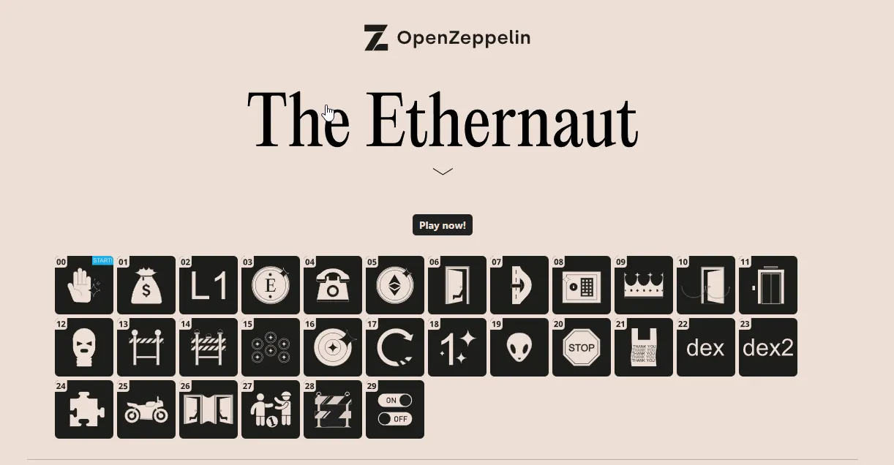

<div align="center">


<br><br>
<h1><strong>OpenZeppelin Ethernaut Solutions</strong></h1>

</div>
<br></br>

## Description

This repository contains the solutions for the [Ethernaut CTF challenges](https://ethernaut.openzeppelin.com/) from OpenZeppelin. The Ethernaut is a Web3/Solidity based wargame inspired by [overthewire.org](https://overthewire.org/wargames/). Each level is a smart contract that needs to be hacked in order to advance to the next level. The challenges are designed to teach the basics of smart contract security and the vulnerabilities that can be found in Solidity code.

- The `challenges` folder contains all the initial Ethernaut smart contracts.
- The `solutions` folder contains the explanations to understand how to beat each level.
- The `src` folder contains the solutions for each level (solidity and/or scripts in the browser console).
- The `helpers` folder contains some older openzeppelin contracts that are needed to compile the challenges.
- The `test` folder contains tests for some levels.

## Tutorial

```shell
await contract.password()
await contract.authenticate("ethernaut0")
```

```
FORK_URL=https://eth-goerli.g.alchemy.com/v2/{API_KEY}
forge test -vvvv --fork-url $FORK_URL --match-path test/13_GateKeeperOne.test.sol
```

## Levels

- [x] Lvl 1 Fallback function
- [x] Lvl 2 Fallout
- [x] Lvl 3 Coin Flip
- [x] Lvl 4 Telephone
- [x] Lvl 5 Token
- [x] Lvl 6 Delegation
- [x] Lvl 7 Force
- [x] Lvl 8 Vault
- [x] Lvl 9 King
- [x] Lvl 10 Re-entrancy
- [x] Lvl 11 Elevator
- [x] Lvl 12 Privacy
- [x] Lvl 13 Gatekeeper 1
- [x] Lvl 14 Gatekeeper 2
- [x] Lvl 15 Naught Coin
- [x] Lvl 16 Preservation
- [x] Lvl 17 Recovery
- [x] Lvl 18 MagicNumber
- [x] Lvl 19 Alien Codex
- [x] Lvl 20 Denial
- [x] Lvl 21 Shop
- [x] Lvl 22 Dex
- [x] Lvl 23 Dex Two
- [x] Lvl 24 Puzzle Wallet
- [ ] Lvl 25 Motorbike (unbeatable since Dencun upgrade, issue with selfdestruct new behavior, see EIP6780)
- [x] Lvl 26 DoubleEntryPoint
- [x] Lvl 27 Good Samaritan
- [x] Lvl 28 Switch
