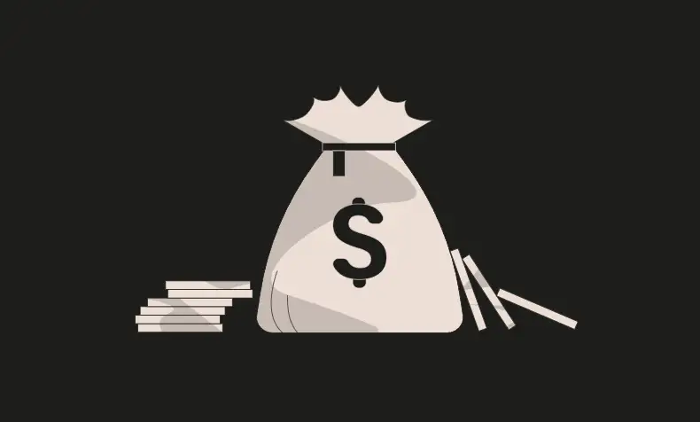
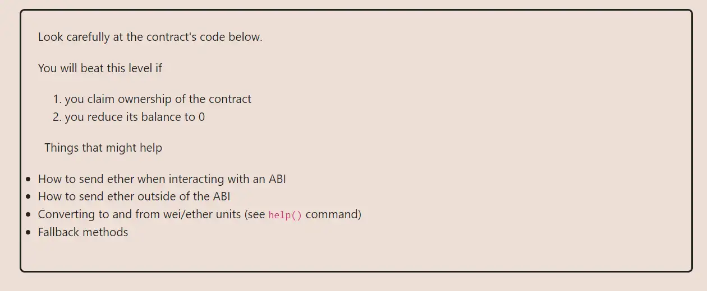

<div align="center">
<p align="left">(<a href="https://github.com/Pedrojok01/Ethernaut-Solutions?tab=readme-ov-file#solutions">back</a>)</p>


<br><br>
<h1><strong>Ethernaut Level 1 - Fallback</strong></h1>

</div>

## Table of Contents

- [Table of Contents](#table-of-contents)
- [Objectif](#objectif)
- [The hack](#the-hack)
- [Solution](#solution)
- [Takeaway](#takeaway)

## Objectif



## The hack

The contract has a `receive` function that is called when the contract receives ether without any data. The contract also has a `contribute` function that is payable. The `contribute` function is the only way to send ether to the contract, but the `require` statement prevents us from abusing the contract. However, nothing prevents us from sending ether directly to the contract, without using any of its functions. The `receive` function will then be triggered.

```javascript
  receive() external payable {
    require(msg.value > 0 && contributions[msg.sender] > 0);
    owner = msg.sender;
  }
```

Now, we just have to figure out how to pass the `require` statement in the `receive` function. The first part is fairly simple, we just have to send any amount of ETH. The second part requires us to `contribute()` first so our balance is greater than 0. That's it. We are the new owner of the contract.

## Solution

1. Start by contributing to fulfill the `require` statement in the `receive()` function
2. Send some eth to the contract directly to trigger the `receive()` function
3. Withdraw all the funds

```javascript
await contract.contribute({ value: toWei("0.00001") });
await contract.sendTransaction({ value: toWei("0.00001") });
await contract.withdraw();
```

## Takeaway

- Use of the `receive` & `fallback` functions
- Never implement critical logic in the fallback/receive function

<div align="center">
<br>
<h2>🎉 Level completed! 🎉</h2>
</div>
