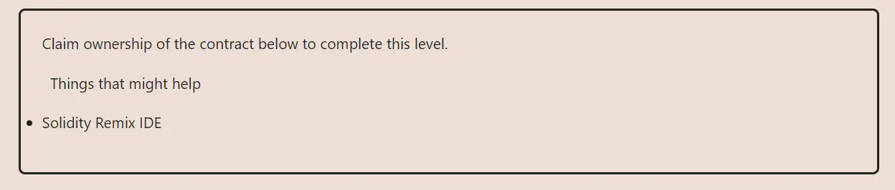

<div align="center">
<p align="left">(<a href="https://github.com/Pedrojok01/Ethernaut-Solutions?tab=readme-ov-file#solutions">back</a>)</p>


<br><br>
<h1><strong>Ethernaut Level 2 - Fallout</strong></h1>

</div>
<br>

Read the article directly on my blog: [Ethernaut Solutions | Level 2 - Fal1out](https://blog.pedrojok.com/the-ethernaut-ctf-solutions-02-fallout)

## Table of Contents

- [Table of Contents](#table-of-contents)
- [Goals](#goals)
- [The hack](#the-hack)
- [Solution](#solution)
- [Takeaway](#takeaway)

## Goals



## The hack

Unlike a normal function that can be called anytime, a constructor is only executed once during the creation of the contract. In solidity versions before `0.8.0`, a constructor was defined by naming it the same as your contract's name.

```javascript
pragma solidity ^0.6.0;

contract Foo {
    // This is a constructor, same name as the contract
    function Foo() public payable {}

    // This is a function
    function foo() public payable {}
}
```

Unfortunately, the typo in the `Fal1out()` function converts it to a normal function instead of a constructor. Because of that, `Fal1out()` is a public function that anyone can call to take ownership of the contract.

```javascript
/* constructor */
  function Fal1out() public payable {
      owner = msg.sender;
      allocations[owner] = msg.value;
  }
```

The `Fal1out` function should have been named `Fallout`.

## Solution

1. Simply call the `Fal1out()` function to take ownership of the contract.

```javascript
await contract.Fal1out();
```

## Takeaway

- Review your code carefully and multiple times before deploying it
- Use tests to catch obvious bugs like this one.

<div align="center">
<br>
<h2>🎉 Level completed! 🎉</h2>
</div>
