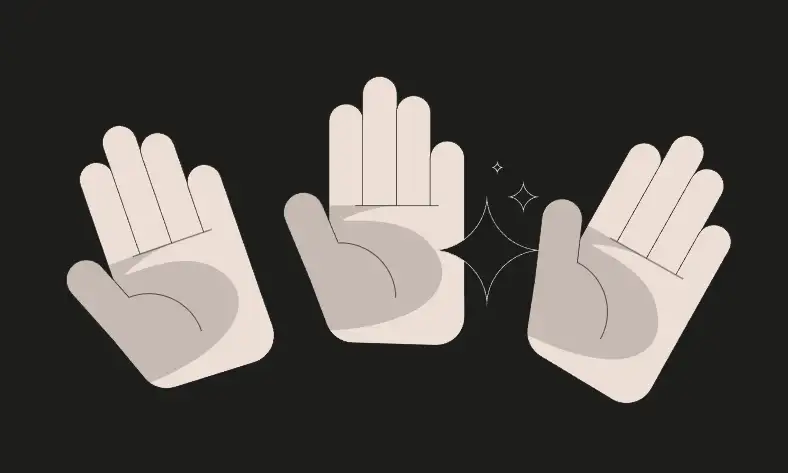

<div align="center">
<p align="left">(<a href="#solutions">back</a>)</p>


<br><br>
<h1><strong>Ethernaut Level 0 - Hello Ethernaut</strong></h1>

</div>

## Objectif

No real objective here except to get familiar with the Ethernaut challenges and the contract interactions. This level is a simple introduction to the Ethernaut game.

## Solution

Just follow the instructions given in the browser's console and you will complete this level in no time. Or you can even cheat and jump directly to the last step...

```javascript
await contract.info();
=> You will find what you need in info1().

await contract.info1();
=> Try info2(), but with "hello" as a parameter.

await contract.info2("hello");
=> The property infoNum holds the number of the next info method to call.

await contract.infoNum();
=> 42

await contract.info42();
=> theMethodName is the name of the next method.

await contract.theMethodName();
=> The method name is method7123949.

await contract.method7123949();
=> If you know the password, submit it to authenticate().

await contract.password();
=> "ethernaut0"

await contract.authenticate("ethernaut0");
```

<div align="center">
<br>
<h2>🎉 Level completed! 🎉</h2>
</div>
