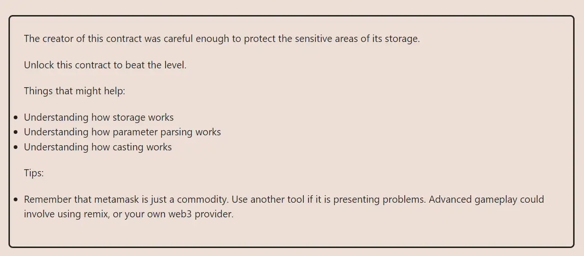

<div align="center">


<br><br>
<h1><strong>Ethernaut Level 12 - Privacy</strong></h1>

</div>

## Table of Contents

- [Table of Contents](#table-of-contents)
- [Objectif](#objectif)
- [The hack](#the-hack)
- [Solution](#solution)
  - [In the browser console:](#in-the-browser-console)
  - [With Foundry using `forge`:](#with-foundry-using-forge)
- [Takeaway](#takeaway)
- [References](#references)

## Objectif



## The hack

Nothing complex in how to solve the challenge, we must retrieve the key and call the `unlock()` function to beat it.

Like in the previous Vault level, we need a good understanding of how storage works in solidity, and how to access it. Only this time, we go a little further as this level introduces static-sized array type.

```javascript
function unlock(bytes16 _key) public {
    require(_key == bytes16(data[2]));
    locked = false;
  }
```

We can see that the `_key` we are looking for must be equal to `bytes16(data[2])`. So how can we access `data[2]`?

Here is the storage:

```javascript
bool public locked = true;
uint256 public ID = block.timestamp;
uint8 private flattening = 10;
uint8 private denomination = 255;
uint16 private awkwardness = uint16(block.timestamp);
bytes32[3] private data;
```

Since there is no inheritance, the storage starts at slot 0 with the `locked` variable and goes as follows:

| Slot | Variable                                    | Type                       | Notes                                                                                                                                |
| ---- | ------------------------------------------- | -------------------------- | ------------------------------------------------------------------------------------------------------------------------------------ |
| 0    | `locked`                                    | `bool`                     | `locked` takes 1 byte, but since the next value doesn't fit in the 31 bytes left, `locked` takes the whole slot (Not best practice!) |
| 1    | `ID`                                        | `uint256`                  | `uint256` takes 32 bytes, so 1 full slot                                                                                             |
| 2    | `flattening`, `denomination`, `awkwardness` | `uint8`, `uint8`, `uint16` | Respectively 1 byte + 1 byte + 2 bytes, so solidity packs these together into a single slot.                                         |
| 3    | `data[0]`                                   | `bytes32`                  | Static arrays start a new storage slot, each `bytes32` element taking one full slot.                                                 |
| 4    | `data[1]`                                   | `bytes32`                  |                                                                                                                                      |
| 5    | `data[2]`                                   | `bytes32`                  | This is the slot containing `data[2]`.                                                                                               |

With this detailed storage layout, we can see that `data[2]` is stored in slot 5. We can now move to the solution.

## Solution

We have to read the storage at slot 5 to get the value of `data[2]`.

### In the browser console:

We can do this by calling the `web3.eth.getStorageAt` function.

```javascript
// Read the storage at slot 5
const contents1 = await web3.eth.getStorageAt(instance, 5);
// Format the key to bytes16
const key = contents1.substring(0, 34);
```

Then we can call the `unlock` function with the value we got from the storage.

```javascript
await contract.unlock(key);
```

### With Foundry using `forge`:

You can also achieve the same with Foundry by using the `vm.load` function. To run the script:

```bash
forge script script/12_Privacy.s.sol:PoC --rpc-url sepolia --broadcast --verify --etherscan-api-key $ETHERSCAN_API_KEY --watch
```

Done.

## Takeaway

- Again, nothing is private on-chain. Everything is public and can be read by anyone.
- Organize your storage to save space and gas.

## References

- Private data: https://solidity-by-example.org/hacks/accessing-private-data/
- EVM storage: https://programtheblockchain.com/posts/2018/03/09/understanding-ethereum-smart-contract-storage/
- Storage layout: https://docs.soliditylang.org/en/latest/internals/layout_in_storage.html

<div align="center">
<br>
<h2>🎉 Level completed! 🎉</h2>
</div>
