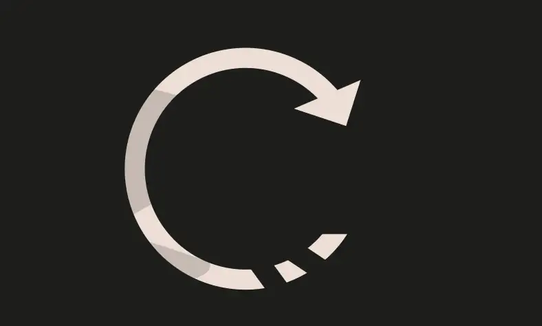
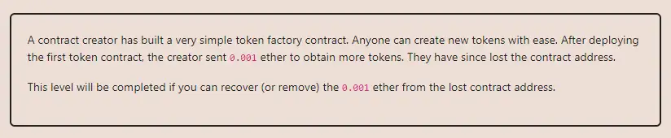

<div align="center">
<p align="left">(<a href="https://github.com/Pedrojok01/Ethernaut-Solutions?tab=readme-ov-file#solutions">back</a>)</p>


<br><br>
<h1><strong>Ethernaut Level 17 - Recovery</strong></h1>

</div>

## Table of Contents

- [Table of Contents](#table-of-contents)
- [Objectif](#objectif)
- [The hack](#the-hack)
- [Solution](#solution)
- [Takeaway](#takeaway)
- [Reference](#reference)

## Objectif



## The hack

From the contract code, we can see that there is a public `destroy()` function that can be used to self-destruct the contract and force send the eth to an arbitrary address. So the challenge is to find the address of the contract that was created by the `Recovery` factory.

The easiest way to find it is to paste the `Recovery` contract address in your favorite block explorer and check for the first (and only) contract deployed from this factory! But... that is not exactly what The Ethernaut is trying to teach us here.

Contract addresses are deterministic and are calculated by `keccak256(address, nonce)` where:

- `address` is the address of the contract (or the Ethereum address that created the transaction);
- `nonce` is the number of contracts the spawning contract has created (or the transaction nonce, for regular transactions).

Based on that, how to retrieve the contract address without a block explorer?

Since Ethereum addresses are deterministic, we can manually re-calculate the lost address.

- The `Recovery` contract address is `0x2333215479D476895b462Ff945f3aF5bA2d0652e` (Replace with your instance address)
- The nonce is 1 or `0x01` (contracts are initialized with nonce 1)

We can use the following code to calculate the address:

```java
bytes32 hash = keccak256(
    abi.encodePacked(bytes1(0xd6), bytes1(0x94), recoveryAddress, bytes1(0x01))
);
address lostAddress = address(uint160(uint256(hash)));
```

`bytes1(0xd6)` and `bytes1(0x94)` are constants related to [Recursive-Length Prefix](https://ethereum.org/en/developers/docs/data-structures-and-encoding/rlp/) (RLP) to encode arbitrarily nested arrays of binary data.

Now that we have the address, we can call the `destroy()` function to recover the funds.

## Solution

Here is the full code:

```javascript
// SPDX-License-Identifier: MIT
pragma solidity ^0.8.20;

// Lost address: 0x9938f099Cb6d3f666C5C168830aDD46952EF421B

interface ISimpleToken {
    function destroy(address to) external;
}

interface IRecovery {}

contract RecoveryService {
    address private immutable recovery;

    constructor(address _recovery) {
        recovery = _recovery;
    }

    function recoverAddress() public view returns (address) {
        bytes32 hash = keccak256(
            abi.encodePacked(bytes1(0xd6), bytes1(0x94), recovery, bytes1(0x01))
        );
        return address(uint160(uint256(hash)));
    }

    function recoverFund() public {
        ISimpleToken(recoverAddress()).destroy(msg.sender);
    }
}
```

You can use the following command to run the forge script:

```bash
forge script script/17_Recovery.s.sol:PoC --rpc-url sepolia --broadcast --verify --etherscan-api-key $ETHERSCAN_API_KEY --watch
```

## Takeaway

- Ethereum addresses are deterministic and are calculated by `keccak256(address, nonce)`.

## Reference

- [How is the address of an Ethereum contract computed?](https://ethereum.stackexchange.com/questions/760/how-is-the-address-of-an-ethereum-contract-computed)
- EIP161: https://eips.ethereum.org/EIPS/eip-161
- Ethereum quirks: https://swende.se/blog/Ethereum_quirks_and_vulns.html

<div align="center">
<br>
<h2>🎉 Level completed! 🎉</h2>
</div>
