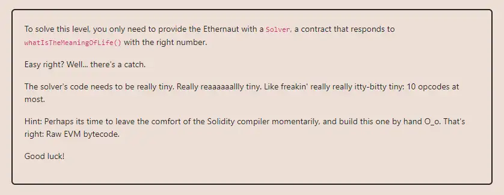

<div align="center">
<p align="left">(<a href="https://github.com/Pedrojok01/Ethernaut-Solutions?tab=readme-ov-file#solutions">back</a>)</p>


<br><br>
<h1><strong>Ethernaut Level 18 - Magic Number</strong></h1>

</div>
<br>

Read the article directly on my blog: [Ethernaut Solutions | Level 18 - Magic Number](https://blog.pedrojok.com/the-ethernaut-ctf-solutions-18-magic-number)

## Table of Contents

- [Table of Contents](#table-of-contents)
- [Goals](#goals)
- [The hack](#the-hack)
  - [Runtime bytecode](#runtime-bytecode)
  - [Creation bytecode](#creation-bytecode)
- [Solution](#solution)
  - [In the browser's console](#in-the-browsers-console)
  - [With Foundry using `forge`:](#with-foundry-using-forge)
- [Takeaway](#takeaway)
- [Reference](#reference)

## Goals



## The hack

Ok, so here it gets way more advanced than previous levels. This level while looking quite simple, requires a deep knowledge of EVM opcode, how the stack works, and contract creation code and runtime code.

Unfortunately, the following will not work:

```javascript
contract Solver {
    function whatIsTheMeaningOfLife() public pure returns (uint256) {
        return 42;
    }
}
```

This is because solidity is a high-level language that has a lot of "built-in" features and checks implemented for us. In other words, way too many opcodes to meet the challenge's requirements.

So as suggested by the challenge, we need to write the contract in raw bytecode. The only things we have to worry about are:

- the contract deployment;
- it should return `42` when called.

In bytecode, this is the equivalent of:

- The <b>creation bytecode</b> in charge of deploying the contract;
- The <b>runtime bytecode</b> will live on-chain and be in charge of executing the contract's code.

The creation bytecode is the first thing that gets executed when deploying a contract. It is in charge of deploying the contract and returning the runtime bytecode. This is why we will start with the runtime bytecode.

### Runtime bytecode

The absolute minimal setup for this contract to return the number 42 would be the following:

1. Store the number 42 in memory;
2. Return the number 42.

In raw bytecode, we can write it like this:

1. Using `MSTORE` to store the number 42 in memory: `mstore(pointer, value)`

| BYTECODE | OPCODE    | VALUE | COMMENT                          |
| -------- | --------- | ----- | -------------------------------- |
| 602a     | 60 PUSH1  | 0x2a  | 42 is 0x2a in hexadecimal        |
| 6080     | 60 PUSH1  | 80    | Memory pointer 0x80              |
| 52       | 52 MSTORE |       | Store 42 at memory position 0x80 |

2. Using `RETURN` to return the number 42 from memory: `return(pointer, size)`

| BYTECODE | OPCODE    | VALUE | COMMENT                                  |
| -------- | --------- | ----- | ---------------------------------------- |
| 6020     | 60 PUSH1  | 0x20  | 32 bytes in hexadecimal                  |
| 6080     | 60 PUSH1  | 80    | Memory pointer 0x80                      |
| f3       | f3 RETURN |       | Return 32 bytes from memory pointer 0x80 |

So here is our full runtime bytecode (smart contract code): `602a60805260206080f3`.
Now, we need to handle the creation code, so we can deploy our contract.

### Creation bytecode

Again, let's start with the absolute minimum we'll need to deploy our contract:

1. Store the runtime bytecode in memory;
2. Return the runtime bytecode.

In raw bytecode, we can write it like this:

1. Using `CODECOPY` to store the runtime bytecode in memory: `codecopy(value, position, destination)`

| BYTECODE | OPCODE      | VALUE | COMMENT                                                                                              |
| -------- | ----------- | ----- | ---------------------------------------------------------------------------------------------------- |
| 600a     | 60 PUSH1    | 0a    | Push 10 bytes (runtime code size)                                                                    |
| 600c     | 60 PUSH1    | 0c    | Copy from memory position at index 12 (initialization code takes 12 bytes, runtime comes after that) |
| 6000     | 60 PUSH1    | 00    | Paste to memory slot 0                                                                               |
| 39       | 39 CODECOPY |       | Store runtime code at memory slot 0                                                                  |

2. Using `RETURN` to return the 10 bytes runtime bytecode from memory starting at offset 22: `return(pointer, size)`

| BYTECODE | OPCODE    | VALUE | COMMENT                               |
| -------- | --------- | ----- | ------------------------------------- |
| 600a     | 60 PUSH1  | 0a    | 10 bytes in hexadecimal               |
| 6000     | 60 PUSH1  | 00    | Memory pointer 0                      |
| f3       | f3 RETURN |       | Return 10 bytes from memory pointer 0 |

Here is the full creation/deployment bytecode: `600a600c600039600a6000f3`.

And concatenating the two and adding `0x` in front, we get the full contract bytecode: `0x600a600c600039600a6000f3602a60805260206080f3`.

## Solution

Now that we have our raw bytecode ready, we can deploy the contract.

### In the browser's console

```javascript
const receipt = await web3.eth.sendTransaction({
  from: player,
  data: "0x600a600c600039600a6000f3602a60805260206080f3",
});
await contract.setSolver(receipt.contractAddress);
```

If you want to test it, you can use the following interface in Remix:

```javascript
interface IMeaningOfLife {
  function whatIsTheMeaningOfLife() external view returns (uint256);
}
```

### With Foundry using `forge`:

You can use the following command:

```bash
forge script script/18_MagicNumber.s.sol:PoC --rpc-url sepolia --broadcast --verify --etherscan-api-key $ETHERSCAN_API_KEY --watch
```

And that's it! We have successfully deployed the contract and solved the level.

## Takeaway

- How the EVM and opcodes work at a low level.
- From low level to high level: Bytecode > Yul/Assembly > Solidity.

## Reference

- EVM opcodes: https://www.evm.codes/
- Simple bytecode contract: https://www.youtube.com/watch?v=0qQUhsPafJc

<div align="center">
<br>
<h2>🎉 Level completed! 🎉</h2>
</div>
