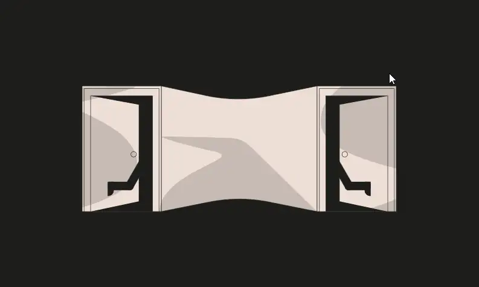

<div align="center">
<p align="left">(<a href="https://github.com/Pedrojok01/Ethernaut-Solutions?tab=readme-ov-file#solutions">back</a>)</p>


<br><br>
<h1><strong>Ethernaut Level 26 - Double Entry Point</strong></h1>

</div>

## Table of Contents

- [Table of Contents](#table-of-contents)
- [Objectif](#objectif)
- [The hack](#the-hack)
  - [Find the bug](#find-the-bug)
  - [Implement the Forta bot](#implement-the-forta-bot)
- [Solution](#solution)
- [Takeaway](#takeaway)
- [Reference](#reference)

## Objectif


## The hack

The goal of the DoubleEntryPoint level is to find the bug in `CryptoVault` contract and to protect it from being drained by implementing a Forta bot.

### Find the bug

The code given is quite long, so let's break it done for clarity. We have 4 contracts to work with:

1. `Forta` - Related to the AlertBot we need to set up.
2. `CryptoVault` - The contract we need to protect. Handles the `underlying` token.
3. `LegacyToken` - A modified ERC20 token (LGT).
4. `DoubleEntryPoint` - The instance we are given and the so-called `underlying` ERC20 token (DET).

We know that the `CryptoVault` is vulnerable. It contains 100 LGT and 100 DET.

Let's forget the `Forta` contract for now. Hard to say what's wrong with the `CryptoVaults` contract at first glance. So let's focus on the token contracts.

```javascript
contract LegacyToken is ERC20("LegacyToken", "LGT"), Ownable {
    DelegateERC20 public delegate;

    // ... access protected functions

    function transfer(address to, uint256 value) public override returns (bool) {
        if (address(delegate) == address(0)) {
            return super.transfer(to, value);
        } else {
            return delegate.delegateTransfer(to, value, msg.sender);
        }
    }
}
```

The LGT token has a custom `transfer` function that delegates the transfer to another contract if `delegate` variable is set, the `delegate` being the `DoubleEntryPoint` contract.

In the DET token, we have a modifier and a `delegateTransfer()` function (we don't need anything related to Forta at this point):

```javascript

contract DoubleEntryPoint is ERC20("DoubleEntryPointToken", "DET"), DelegateERC20, Ownable {

    modifier onlyDelegateFrom() {
        require(msg.sender == delegatedFrom, "Not legacy contract");
        _;
    }

    function delegateTransfer(
        address to,
        uint256 value,
        address origSender
    ) public override onlyDelegateFrom fortaNotify returns (bool) {
        _transfer(origSender, to, value);
        return true;
    }
}
```

The modifier is making sure that only the `delegatedFrom` contract can call the `delegateTransfer` function. The `delegateTransfer` function is the one that is called by the `LegacyToken` contract.

Now, back to the `CryptoVault` contract. There is nothing really interesting except the `sweeppToken()` function.

```javascript
function sweepToken(IERC20 token) public {
    require(token != underlying, "Can't transfer underlying token");
    token.transfer(sweptTokensRecipient, token.balanceOf(address(this)));
}
```

This function allows to transfer the whole balance of any token from the `CryptoVault` contract to the `sweptTokensRecipient`, as long as it is not the `underlying` token. But... what if we try to transfer the LGT token instead?

The `CryptoVault::sweepToken` will call the `LegacyToken::transfer` which will forward the call to the `DoubleEntryPoint::delegateTransfer`.

At this point, `msg.sender` is the `CryptoVault` contract and `value` is the `CryptoVault` LGT's balance. So this will bypass the `onlyDelegateFrom` check. Only this is not transferring the LGT token anymore, but the `underlying` DET token!

### Implement the Forta bot

To mitigate this vulnerability, we need to implement a Forta AlertBot that will trigger an alert if `origSender == cryptoVault` in the `delegateTransfer` function, via the `fortaNotify` modifier.

In the `Forta` contract, there is a `setDetectionBot` function that we can use to implement our bot. And we have the following `IDetectionBot` interface:

```javascript
interface IDetectionBot {
    function handleTransaction(address user, bytes calldata msgData) external;
}
```

So we have to create the logic for the `handleTransaction()` function that will call the `IForta.raiseAlert` function if `origSender == cryptoVault`.

`DoubleEntryPoint::fortaNotify()` is passing `msg.data` to the `Forta::notify()` function.

- Initially, `msg.data` is the data for the `function delegateTransfer(address to, uint256 value, address origSender)` function.
- Then, in `Forta::notify()`, the data is updated to the data of the `handleTransaction(user, msgData)` function.

So that will look something like this:

> handleTransaction(user, msgData);
>
> > Where `msgData == delegateTransfer(to, value, origSender);`

So to access the `origSender` variable, we need to understand how a calldata is structured.

| Position | Bytes/Length | Type    | Value                             |
| -------- | ------------ | ------- | --------------------------------- |
| 0x00     | 4            | bytes4  | selector of `handleTransaction()` |
| 0x04     | 32           | address | `user` address                    |
| 0x24     | 32           | uint256 | Offset of `msgData`               |
| 0x44     | 32           | uint256 | Length of `msgData`               |
| 0x64     | 4            | bytes4  | selector of `delegateTransfer()`  |
| 0x28     | 32           | address | `to` address                      |
| 0x88     | 32           | uint256 | `value` parameter                 |
| 0xa8     | 32           | address | => `origSender` address <=        |
| 0xc8     | 28           | bytes   | zero-padding                      |

We can use a bit of assembly to access the `origSender` variable:

```javascript
assembly {
    origSender := calldataload(0xa8)
}
```

## Solution

Here is the full solution for the `AlertBot` contract:

```javascript
// SPDX-License-Identifier: MIT
pragma solidity ^0.8.20;

interface IDetectionBot {
    function handleTransaction(address user, bytes calldata msgData) external;
}

interface IForta {
    function raiseAlert(address user) external;
}

contract AlertBot is IDetectionBot {
    address private immutable cryptoVault;

    constructor(address _cryptoVault) public {
        cryptoVault = _cryptoVault;
    }

    function handleTransaction(
        address user,
        bytes calldata msgData
    ) external override {
        address origSender;
        assembly {
            origSender := calldataload(0xa8)
        }

        if (origSender == cryptoVault) {
            IForta(msg.sender).raiseAlert(user);
        }
    }
}
```

Then you can run the script with the following command:

```bash
forge script script/26_DoubleEntryPoint.s.sol:PoC --rpc-url sepolia --broadcast --verify --etherscan-api-key $ETHERSCAN_API_KEY --watch
```

## Takeaway

- Detection Bots can be used to monitor any activity on the blockchain and trigger alerts.

## Reference

- Forta bot: https://docs.forta.network/en/latest/
- CallData structure: https://docs.soliditylang.org/en/latest/abi-spec.html#abi

<div align="center">
<br>
<h2>🎉 Level completed! 🎉</h2>
</div>
