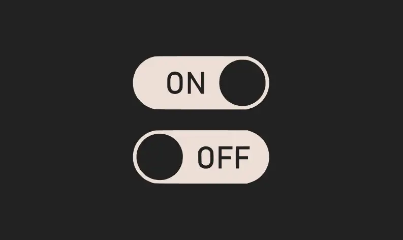
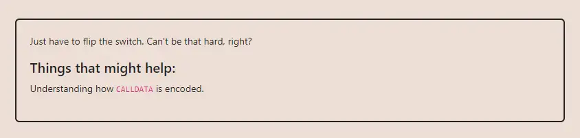

(<a href="https://github.com/Pedrojok01/Ethernaut-Solutions?tab=readme-ov-file#solutions">back</a>)

  
<h1><strong>Ethernaut Level 29 - Switch</strong></h1>

## Table of Contents

- [Table of Contents](#table-of-contents)
- [Objectif](#objectif)
- [The hack](#the-hack)
- [Solution](#solution)
- [Takeaway](#takeaway)

## Objectif

## The hack

## Solution

## Takeaway

 
<h2>🎉 Level completed! 🎉</h2>

