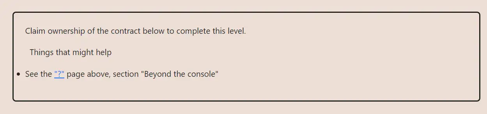

<div align="center">


<br><br>
<h1><strong>Ethernaut Level 4 - Telephone</strong></h1>

</div>

## Table of Contents

- [Table of Contents](#table-of-contents)
- [Objectif](#objectif)
- [The hack](#the-hack)
  - [Example Explanation](#example-explanation)
- [Solution](#solution)
- [Takeaway](#takeaway)
- [Reference:](#reference)

## Objectif



## The hack

The goal here is to understand the difference between `msg.sender` and `tx.origin`. The `Telephone` contract is vulnerable to a phishing attack because it uses `tx.origin` to check who initiated the transaction.

- `tx.origin` is the original sender of the transaction, the first account that signed the transaction. It can either be an EOA (Externally Owned Account) or an [ERC-4337](https://eips.ethereum.org/EIPS/eip-4337) contract. It is a static value that does not change, regardless of the number of calls in the stack (think nested transactions).
- `msg.sender` is the address that initiated the latest call in the transaction. It can change if the transaction is a call from another contract for instance. So if there are multiple calls following each other in the same transaction, `msg.sender` will always be the address that initiated the latest call, and its value will change with every new call made within this transaction.

### Example Explanation

- **Direct Call (EOA to Contract)**

  - `EOA => Contract` | `tx.origin === msg.sender === EOA`

- **Indirect Call (EOA through Contract1 to Contract2)**
  - `EOA => Contract1 => Contract2`
    - For `Contract1`: `tx.origin === msg.sender === EOA`
    - For `Contract2`: `tx.origin === EOA`, `msg.sender === Contract1`

In other words, we simply have to deploy an intermediary contract to bypass `tx.origin != msg.sender`. `tx.origin` will be our EOA while `msg.sender` will be the address of the intermediary contract.

## Solution

Write another contract that calls the deployed Telephone contract and passes in the new owner's address

```javascript
// SPDX-License-Identifier: MIT
pragma solidity ^0.8.20;

interface ITelephone {
    function changeOwner(address _owner) external;
}

contract MissedCall {
    address immutable telephone;

    constructor(address _telephone) {
        telephone = _telephone;
    }

    function attack() public {
        ITelephone(telephone).changeOwner(msg.sender);
    }
}
```

## Takeaway

- Usage of `tx.origin` should be done with care, as it can lead to phishing attacks;
- Useful in certain cases where you want EOA accounts to call a function for example

## Reference:

https://solidity-by-example.org/hacks/phishing-with-tx-origin/

<div align="center">
<br>
<h2>🎉 Level completed! 🎉</h2>
</div>
