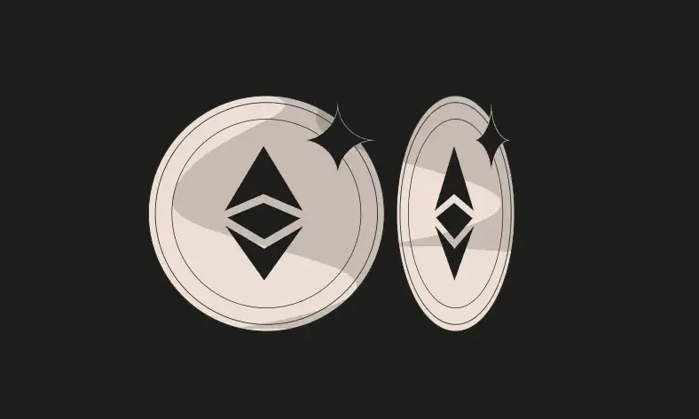
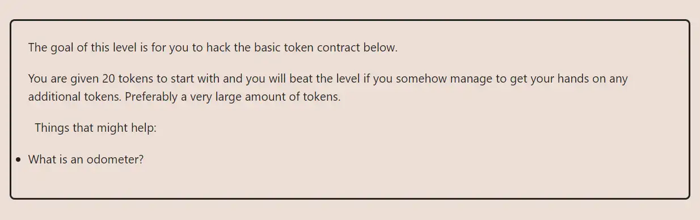

<div align="center">


<br><br>
<h1><strong>Ethernaut Level 5 - Token</strong></h1>

</div>

## Table of Contents

- [Table of Contents](#table-of-contents)
- [Objectif](#objectif)
- [The hack](#the-hack)
- [Solution](#solution)
- [Takeaway](#takeaway)

## Objectif



## The hack

Odometer implies a counter -> Overflow/Underflow

## Solution

You start with 20 tokens, based on how the require function is written, it is easy to make it overflow
e.g: `20 - (20+1) = -1 ` which in solidity overflows.
The only thing required to solve this level

```
await contract.transfer("random address", 20+1)
```

## Takeaway

Overflows are very common in solidity and must be checked for with control statements

<div align="center">
<br>
<h2>🎉 Level completed! 🎉</h2>
</div>
